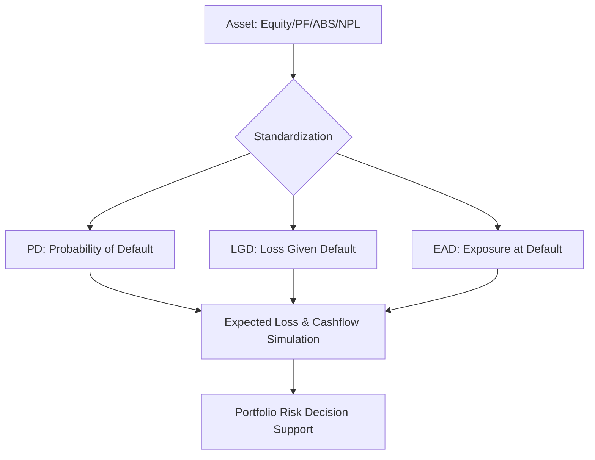

# 🏛️ IB Integrated Wiki (투자은행 통합 지식 라이브러리)

> **"자산이 아닌 리스크를 통합한다 (Integrate the Risk, not the Asset)"**

본 프로젝트는 투자은행(IB) 실무에서 다루는 4대 핵심 자산군(**NPL**, **PF**, **Equity**, **ABS**)의 지식을 체계적으로 구조화하고, 이를 '미래 현금흐름의 불확실성'이라는 단일 관점으로 통합하여 관리하는 개인용 지식 위키입니다.

---

## 🌟 프로젝트 취지 (Vision & Mission)

실무에서 접하는 각 자산군은 서로 다른 명칭과 리스크 구조를 가지고 있어, 이를 통합적으로 이해하는 데 한계가 있습니다. 본 위키는 이러한 지식의 파편화(Silo)를 해결하기 위해 다음을 지향합니다:

1.  **금융의 표준 언어 수립**: 모든 자산을 **PD(부도 확률)**, **LGD(손실률)**, **EAD(익스포저)**라는 공통 언어로 치환합니다.
2.  **현금흐름 중심의 사고**: 자산의 외형보다는 미래에 발생할 **현금흐름(Cashflow)**의 형태와 불확실성에 집중합니다.
3.  **지능형 지식 관리**: 신규 문서를 자동으로 정제하고 카테고리화하는 **AI 워크플로우**를 통해 지식의 선순환을 추구합니다.

---

## 📂 위키 구조 (Structure)

위키의 내용은 `src/` 디렉토리 아래에 체계적으로 분류되어 있습니다.

-   🚀 **[통합 리스크 대시보드](src/DASHBOARD.md)**: **4대 자산 통합 관제 및 리스크 현황 (Dashboard)**
-   **[01_Foundations](src/01_Foundations/IB_Overview.md)**: IB의 기본 개념, 가치 사슬, 전사 리스크 정책.
-   **[02_Integrated_IB](src/02_Integrated_IB/Synthesis_Map.md)**: 자산군 간의 시너지 맵, 통합 리스크 프레임워크 및 기술 사양.
-   **[03_Assets_Verticals](src/03_Assets_Verticals/NPL/Basics.md)**: NPL, PF, ABS, Equity 각 도메인의 심층 기초 지식.
-   **[00_Inbox](src/00_Inbox/README.md)**: 신규 지식을 입수하고 자동으로 분류하기 위한 대기소.
-   **[99_System](src/99_System/PROJECT_CONTEXT.md)**: 위키 운영 계획, 로깅 및 프로젝트 문맥 정보.

---

## 🛠️ 활용 방법 (How to Use)

### 1. 지식 탐색
-   처음 방문하셨다면 **[IB 개요](src/01_Foundations/IB_Overview.md)**와 **[통합 리스크 프레임워크](src/02_Integrated_IB/01_Unified_Risk_Framework.md)**부터 시작하시는 것을 추천합니다.
-   모든 문서 하단에는 **'관련 문서'** 링크가 있어 상호 참조가 가능합니다.

### 2. 신규 문서 입수 (AI Workflow)
기존에 정리된 파일이나 새로운 리서치 자료가 있다면 다음 단계를 따르세요:
1.  파일을 `src/00_Inbox/` 폴더에 업로드합니다.
2.  Antigravity(AI 에지전트)에게 **"인박스 처리해줘"**라고 요청합니다.
3.  AI가 문서를 분석하여 위키 스타일로 변환한 후, 적절한 카테고리로 이동시키고 아카이브합니다.

---

## 📊 리스크 통합 아키텍처

---

## 👨‍💻 관리 및 기여
본 위키는 **Antigravity AI**에 의해 관리되며, 모든 데이터는 **GitHub** 원격 저장소와 동기화됩니다.

- **원격 저장소**: [https://github.com/kbgkim/ib_wiki](https://github.com/kbgkim/ib_wiki)
- **최종 업데이트**: 2026-04-14

---
*Created by [Antigravity](https://github.com/kbgkim)*
