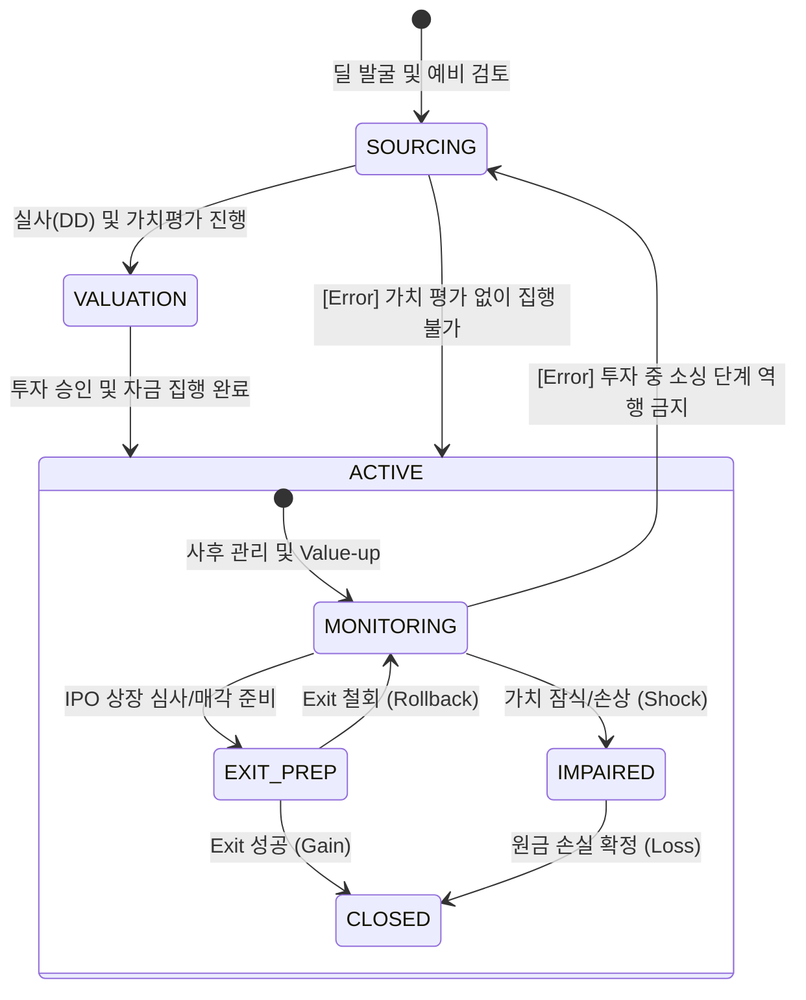

# 지분 투자 라이프사이클 및 이벤트 모델 명세

## 1. 개요 (Overview)
본 문서는 지분 투자(Equity) 딜의 생애주기를 상태 전이(State Transition)와 비즈니스 이벤트(Event) 관점에서 정의합니다. 모든 이벤트는 **정량적 트리거**와 **정합성 검증 레이어**를 통해 실행 가능한 시스템 사양으로 명세화되었습니다.

---

## 2. State Machine (상태 전이 모델)

지분 투자 딜의 상태는 실사 강도와 Exit 준비 단계에 따라 다음과 같이 전이됩니다.

---

## 3. Full Event Catalog & Validation Layer

| Event Name | Pre-condition (필수 상태/데이터) | Trigger Condition (정량적/결정적) | Post-state | Invalid Transition |
| :--- | :--- | :--- | :--- | :--- |
| **VALUATION_FINALIZED** | `SOURCING` / `DD_Report` | 투심위 상정용 최종 가치 산정 완료 | `VALUATION` | `ACTIVE` 역발생 금지 |
| **FUNDING_COMPLETED** | `VALUATION` / `Share_Agreement` | 주권 인수 및 대금 지급 완료 | `ACTIVE:MONITORING` | `SOURCING` 직접 발생 |
| **MTM_SHOCK_EVENT** | `MONITORING` / `Market_Index` | **자산 가치 < 장부가액의 50%** | `IMPAIRED` | `SOURCING` 상태 |
| **IPO_FILED** | `MONITORING` / `Exchange_Receipt` | 거래소 상장 예비 심사 청구 완료 | `EXIT_PREP` | `VALUATION` 상태 |
| **EXIT_SUCCESS** | `EXIT_PREP` / `Closing_Report` | **실현 IRR > 15%** 또는 매각가 달성 | `CLOSED` | `SOURCING` 직접 전이 |
| **INVESTMENT_WRITE_OFF**| `IMPAIRED` / `Bankruptcy_Log` | **청산 가치 < 잔여 채무** 확정 시 | `CLOSED` (Loss) | `SOURCING` 상태 |

---

## 4. 리스크 전이 논리 (Event Logic)

### 가. 정합성 검증 규칙 (Validation Rules)
1. **정량적 손상 인지**: `MTM_SHOCK_EVENT`는 장부 가치 대비 50% 하락이라는 정량적 기준에 의해 트리거됨.
2. **후순위성 원칙**: `INVESTMENT_WRITE_OFF`는 반드시 선순위 채권자의 손실 발생이 데이터로 증빙된 후 실행됨.
3. **Exit 경로 정합성**: `EXIT_SUCCESS`는 반드시 `EXIT_PREP` 상태에서 생성된 `Closing_Report` 참조를 포함해야 함.

---

## 🔗 연결
- [이벤트 핸들러 실행 명세](../../06_Execution_Flow/EVENT_HANDLER_SPEC.md)
- [지분 투자 도메인 기초 및 명세](./Basics.md)

### ─────────────

*최종 업데이트: 2026-04-16 (Audit 결함 해결 및 트리거 정량화)*
