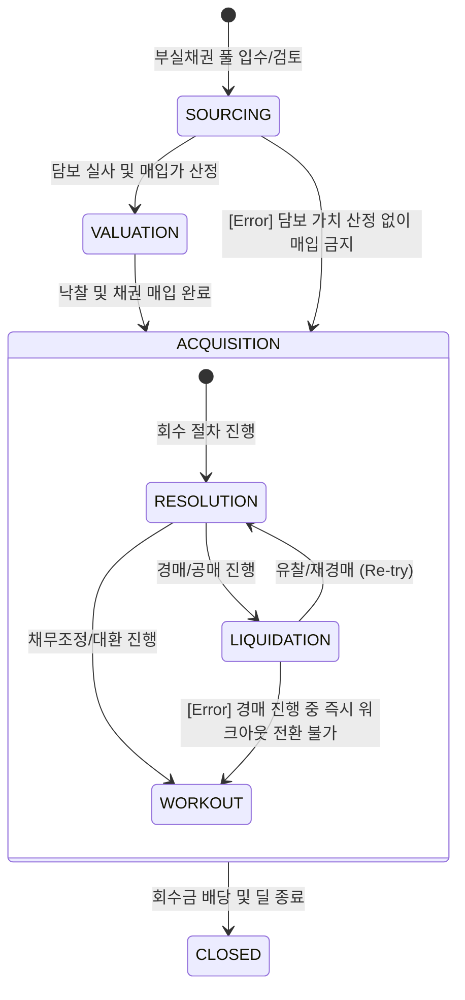

# NPL 라이프사이클 및 이벤트 모델 명세

## 1. 개요 (Overview)
본 문서는 NPL(부실채권) 딜의 생애주기를 상태 전이(State Transition)와 비즈니스 이벤트(Event) 관점에서 정의합니다. 모든 이벤트는 **정량적 트리거**와 **정합성 검증 레이어**를 통해 실행 가능한 시스템 사양으로 명세화되었습니다.

---

## 2. State Machine (상태 전이 모델)

NPL 딜의 상태는 매입 후 회수 전략 실행 단계에 따라 다음과 같이 전이됩니다.

---

## 3. Full Event Catalog & Validation Layer

| Event Name | Pre-condition (필수 상태/데이터) | Trigger Condition (정량적/결정적) | Post-state | Invalid Transition |
| :--- | :--- | :--- | :--- | :--- |
| **PORTFOLIO_ACQUIRED** | `VALUATION` / `Final_Bid_Price` | 채권 양수도 계약 및 대금지급 완료 | `ACQUISITION` | `SOURCING` 직전이 |
| **ASSET_VALUED** | `SOURCING` / `Site_Visit_Log` | 현장 실사 및 감정평가 완료 | `VALUATION` | `CLOSED` 상태 |
| **RESOLUTION_PATH_SET**| `ACQUISITION` / `LTV_Data` | **예상 LTV < 60% 시 경매(Liquidation) 강제** | `RESOLUTION:LIQUIDATION` | `SOURCING` 상태 |
| **AUCTION_SUCCESSFUL** | `LIQUIDATION` / `Court_Order` | 경매 낙찰 및 배당금 확정 | `CLOSED` | `WORKOUT` 직접 발생 |
| **WORKOUT_AGREED** | `RESOLUTION` / `Agreement_Doc` | **LTV > 70% 및 채무자 소득 증빙** 시 합의 | `WORKOUT` | `LIQUIDATION` 직접 발생 |
| **AUCTION_FAILED** | `LIQUIDATION` / `No_Bidder` | **매각가 < 최초 감정가의 70%** 도달 시 | `RESOLUTION` (Re-try) | `CLOSED` 상태 |
| **COLLECTION_FINAL** | `Recovered` or `WORKOUT` | 잔여 원리금 100% 정리 완료 | `CLOSED` | `VALUATION` 상태 |

---

## 4. 리스크 전이 논리 (Event Logic)

### 가. 정합성 검증 규칙 (Validation Rules)
1. **정량적 경로 선택**: 회수 경로는 사전에 정의된 LTV 임계치에 따라 결정적(Deterministic)으로 선택됨.
2. **PD 고정 원칙**: NPL 도메인 내의 모든 이벤트는 `PD=100%`를 유지하며 리스크 엔진은 회수율(Recovery Rate) 유동성만 추적함.
3. **가치 하한선(Floor)**: `AUCTION_FAILED`가 3회 이상 반복될 경우 엔진은 자동으로 `WORKOUT` 전환 로직을 가동함.

---

## 🔗 연결
- [이벤트 핸들러 실행 명세](../../06_Execution_Flow/EVENT_HANDLER_SPEC.md)
- [NPL 도메인 기초 및 명세](./Basics.md)

### ─────────────

*최종 업데이트: 2026-04-16 (Audit 결함 해결 및 트리거 정량화)*
