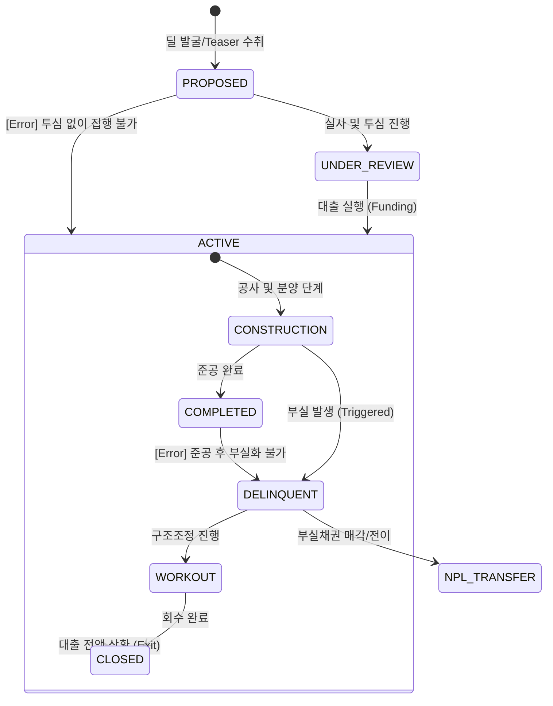

# PF 라이프사이클 및 이벤트 모델 명세

## 1. 개요 (Overview)
본 문서는 PF(프로젝트 파이낸싱) 딜의 생애주기를 상태 전이(State Transition)와 비즈니스 이벤트(Event) 관점에서 정의합니다. 모든 이벤트는 **정량적 트리거**와 **정합성 검증 레이어**를 통해 실행 가능한 시스템 사양으로 명세화되었습니다.

---

## 2. State Machine (상태 전이 모델)

PF 딜의 상태는 인허가 및 자금 조달 단계에 따라 다음과 같이 전이됩니다.

---

## 3. Full Event Catalog & Validation Layer

| Event Name | Pre-condition (필수 상태/데이터) | Trigger Condition (정량적/결정적) | Post-state | Invalid Transition |
| :--- | :--- | :--- | :--- | :--- |
| **MANDATE_RECEIVED** | `PROPOSED` / `Project_ID` | 주관사 선정 및 계약 체결 | `UNDER_REVIEW` | `ACTIVE`로의 직전이 |
| **LOAN_APPROVED** | `UNDER_REVIEW` / `Credit_Commit_ID` | 투심 승인 (LTV < 70% 준수) | `UNDER_REVIEW` (Approved) | `PROPOSED` 상태 |
| **FUNDING_EXECUTED** | `Approved` / `준공확약서` | 대출 계약 체결 (First Drawdown) | `ACTIVE:CONSTRUCTION` | `CLOSED` 상태 |
| **PRE_SALE_SHORTFALL**| `CONSTRUCTION` / `Presale_Rate` | **분양률 < 30%** (또는 이자보상배수 < 1.0) | `DELINQUENT` | `COMPLETED` 상태 |
| **COMPLETION_RISK** | `CONSTRUCTION` / `Progress_Rate` | **공사 지연 > 90일** 또는 시공사 등급 < BB | `DELINQUENT` | `CLOSED` 상태 |
| **WORKOUT_INITIATED** | `DELINQUENT` / `Workout_Plan` | 채대주단 2/3 이상 자율협약 동의 | `WORKOUT` | `CONSTRUCTION` 상태 |
| **RECOVERY_INITIATED**| `DELINQUENT` / `Default_Event` | 담보권 실행 및 NPL 매각 결정 | `NPL_TRANSFER` | `PROPOSED` 상태 |
| **EXIT_COMPLETED** | `COMPLETED` / `Closing_Settlement` | 대출 원리금 100% 상환 | `CLOSED` | `DELINQUENT` 상태 |
| **WORKOUT_END** | `WORKOUT` / `Restructuring_Doc` | 채무 조정 합의 및 이행 완료 | `CLOSED` | `PROPOSED` 상태 |

---

## 4. 리스크 전이 논리 (Event Logic)

### 가. 정합성 검증 규칙 (Validation Rules)
1. **정량적 트리거 우선**: 모든 부실(`DELINQUENT`) 전이는 사전에 정의된 임계치(분양률, 지연일수 등) 초과 시 자동 트리거됨.
2. **상태 배타성**: `CONSTRUCTION` 상태와 `WORKOUT` 상태는 상호 배타적임.
3. **경로 고정**: 모든 딜은 `CLOSED` 또는 `NPL_TRANSFER` 상태에 도달해야 도메인 라이프사이클이 종료됨.

---

## 🔗 연결
- [이벤트 핸들러 실행 명세](../../06_Execution_Flow/EVENT_HANDLER_SPEC.md)
- [PF 도메인 기초 및 명세](./Basics.md)

### ─────────────

*최종 업데이트: 2026-04-16 (Audit 결함 해결 및 트리거 정량화)*
