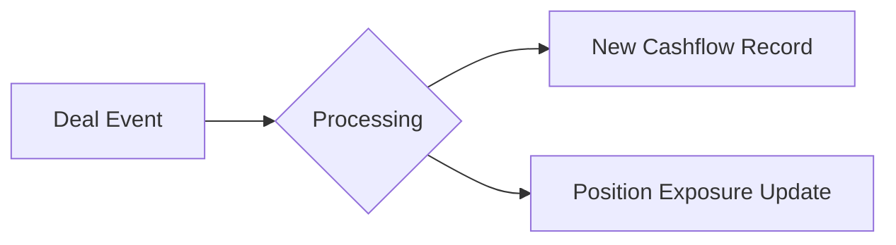

# 딜 이벤트 모델 (Deal_Event_Model)

## 🔥 목적

IB 딜(Deal)의 생명주기 동안 발생하는 주요 비즈니스 이벤트를 정의하고, 이것들이 포지션 및 현금흐름에 미치는 영향을 기술합니다.

### ─────────────

## 📌 개념

딜 이벤트는 정적인 자산 데이터에 동적인 변화를 주는 '트리거'입니다.

👉 **역할**
- Deal Lifecycle Management (생애주기 관리)
- Cashflow Trigger (현금흐름 발생 유도)
- Status Transition (상태 전이 제어)

### ─────────────

## 🧠 주요 이벤트 유형

### 1. 전향적 이벤트 (Positive Events)
- **Drawdown**: 대출금 인출 또는 투자 집행  
- **Repayment**: 차주의 원리금 상환  
- **Exit**: 자산 매각 또는 IPO 성공  

### 2. 부정적 이벤트 (Negative Events)
- **Delinquency**: 이자 지급 지연 (단기 연체)  
- **Default (EOD)**: 기한이익상실 또는 파산 사건  
- **Covenant Breach**: 재무 약정 위반  

### ─────────────

## 💰 현금흐름과의 연결성

이벤트가 발생하면 해당 포지션의 현금흐름 테이블(`CASHFLOW_EVENT`)에 새로운 레코드가 생성되거나 상태가 변경됩니다.

### ─────────────

## 🔗 연결

- [딜 스키마 (Deal Schema)](../01_Schemas/Deal_Schema.md)
- [포지션 스키마 (Position Schema)](../01_Schemas/Position_Schema.md)

### ─────────────

*최종 업데이트: 2026-04-14*