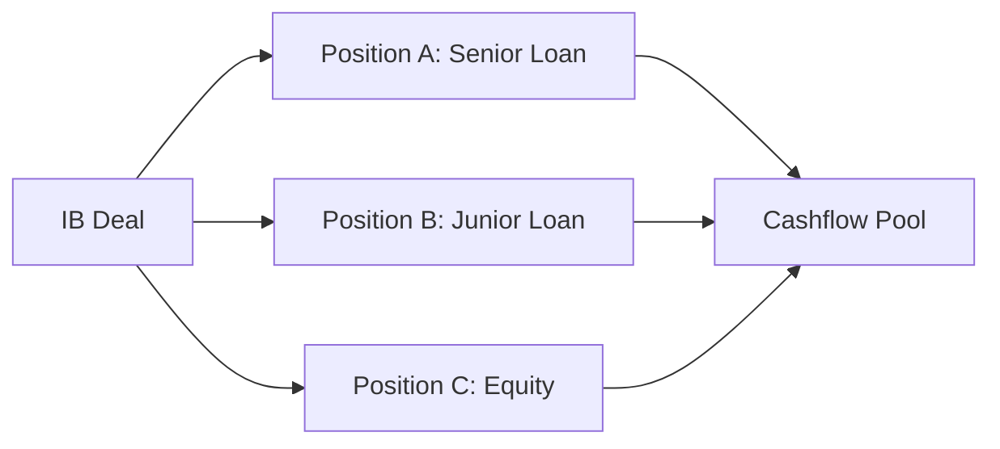

# 포지션 (Position)

## 🔥 목적

포지션(Position)은 리스크 산출 및 관리의 최소 기본 단위입니다. 
하나의 딜(Deal)은 다수의 포지션(Tranche, Loan 등)으로 구성될 수 있으며, 모든 리스크 변수와 현금흐름은 포지션 단위로 귀속됩니다.

### ─────────────

## 📌 개념

포지션은 투자 대상의 경제적 권리와 의무가 정의된 '계좌' 혹은 '슬롯'과 같습니다.

👉 모든 리스크 산출은 **포지션** 단위에서 시작됩니다.

### POSITION의 3요소
- **자산 속성**: Equity, Loan, Bond, Mezzanine 등
- **권리 순위**: Senior, Mezzanine, Junior (Waterfall 우선순위)
- **익스포저(Exposure)**: 현재 노출된 위험 원금액

### ─────────────

## 🧠 구조 역할

### 딜과 포지션의 관계

### 소속 관계 정의
- **상위**: 딜(Deal) - 비즈니스 시나리오 및 통제 단위
- **하위**: 현금흐름(Cashflow) - 포지션에서 파생되는 실제 자본 흐름

### ─────────────

## 📊 구성 요소

| 항목 | 설명 | 주요 변수 |
| :--- | :--- | :--- |
| **Exposure** | 포지션의 계약상 원동력 | Current Exposure |
| **Risk Metrics** | 해당 포지션의 리스크 프로파일 | PD, LGD, EAD |
| **Cashflow Link** | 포지션에 할당된 현금 유출입 | Cashflow ID |

### ─────────────

## 💰 Cashflow 관점

포지션은 현금흐름의 **'필터'**이자 **'바스켓'**입니다.

1. 기초자산에서 현금흐름 발생
2. 포지션의 우선순위에 따라 현금 분배 (Waterfall)
3. 분배된 현금흐름을 바탕으로 포지션의 가치 및 손실 산출

### ─────────────

## ⚖️ 자산별 예시

### PF (Project Financing)
- 예: A 아파트 건설 프로젝트 (Deal)
- 포지션 1: 선순위 대출 (Senior Position)
- 포지션 2: 시행사 지분 (Equity Position)

### NPL (Non-Performing Loan)
- 예: B 공장 담보 채권 포트폴리오 (Deal)
- 포지션: 개별 담보부 채권 (Position)

### ─────────────

## 🔗 연결

- [딜 스키마 (Deal Schema)](../05_Data_Model/01_Schemas/Deal_Schema.md)
- [포지션 스키마 (Position Schema)](../05_Data_Model/01_Schemas/Position_Schema.md)
- [현금흐름 (Cashflow)](./Cashflow.md)
- [기대손실 (Expected Loss)](./Expected_Loss.md)

### ─────────────

*최종 업데이트: 2026-04-14*