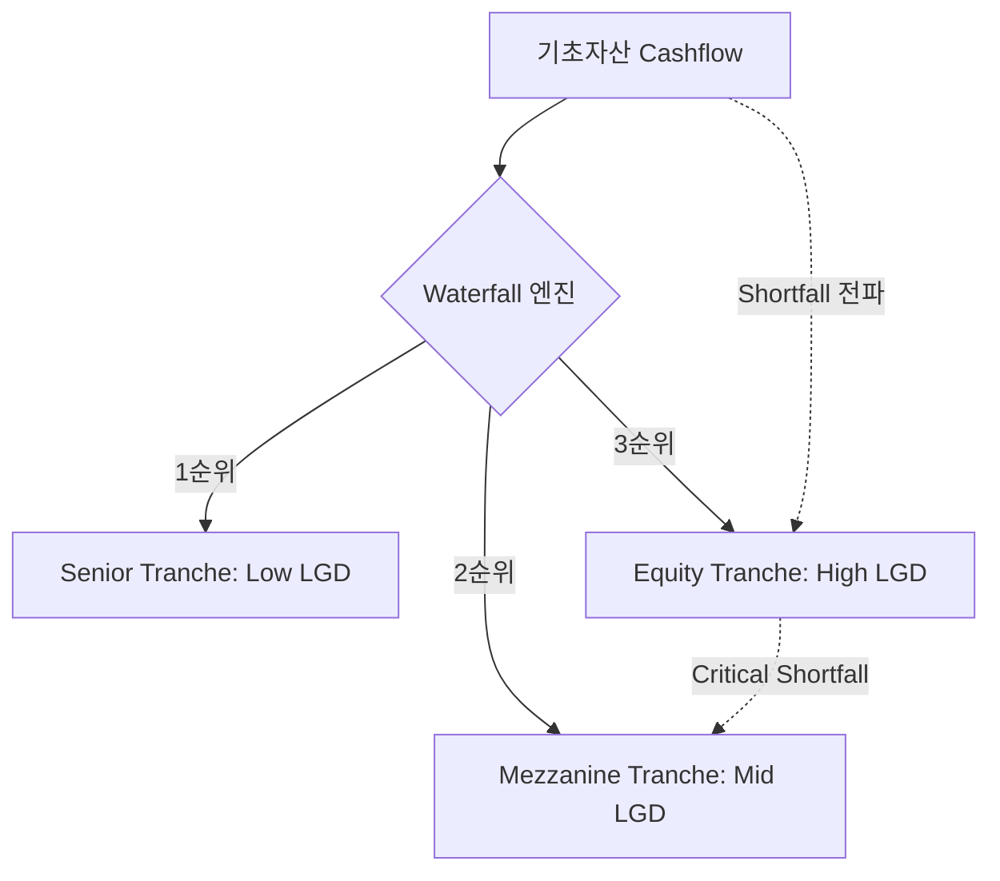

# ABS 리스크 매핑 가이드 (ABS Risk Mapping Guide)

## 🔥 목적

자산유동화(ABS) 자산의 리스크 구조를 표준화된 PD, LGD, EAD 프레임워크로 변환하는 기준을 정의합니다. 
ABS는 기초자산의 현금흐름이 트랜치 순위에 따라 분배되는 **'구조화 신용 리스크'**로 분류됩니다.

### ─────────────

## 📌 매핑 매커니즘 (Mapping Mechanism)

ABS 리스크는 기초자산(Underlying Assets)의 부도율과 유동화 구조(Waterfall)의 안정성을 통해 산출됩니다.

### 리스크 변수 매핑 테이블

| 구분 | ABS 리스크 요인 | 통합 모델 변수 (Standard) |
| :--- | :--- | :--- |
| **기초자산 부도** | Underlying Assets의 PD | **PD (부도확률)** |
| **구조 손실** | 트랜치 순위, 신용보강(Over-collateralization) | **LGD (손실률)** |
| **투자 규모** | 실제 투자된 유동화 증권 액면가 | **EAD (익스포저)** |

### ─────────────

## ⚙️ 워터폴 구조 (Waterfall Structure)

기초자산에서 유입된 현금흐름은 사전에 정의된 우선순위에 따라 각 포지션(Tranche)에 배분됩니다.

### 현금 배분 순위
1. **운영 비용/세금**: 자산보유자 및 수탁기관 수수료  
2. **선순위 이자**: Senior Tranche 이자 지급  
3. **선순위 원금**: Senior Tranche 원금 상환  
4. **후순위 잔여 수익**: Junior/Equity Tranche 수익 배분  

### ─────────────

## 🧠 리스크 전이 다이어그램

기초자산의 부실은 워터폴의 최하단 트랜치부터 순차적으로 전이됩니다.

### ─────────────

## 📊 핵심 리스크 요인

### 신용보강 부족 리스크
- 기초자산 손실이 신용보강 한도(Subordination Level)를 초과하여 선순위까지 전이될 리스크

### 유동성 미스매치 리스크
- 기초자산 회수 시점과 유동화증권 상환 시점의 불일치로 인한 조기상환 혹은 상환 지연 리스크

### ─────────────

## 🔗 연결

- [통합 리스크 프레임워크](../01_Unified_Risk_Framework.md)
- [포지션 (Position)](../01_Core_Model/Position.md)
- [ABS 기초 지식](../../03_Assets_Verticals/ABS/Basics.md)
- [기대손실 산출 (EL Calculation)](../03_Risk_Calculation/EL_Calculation.md)

### ─────────────

*최종 업데이트: 2026-04-14*