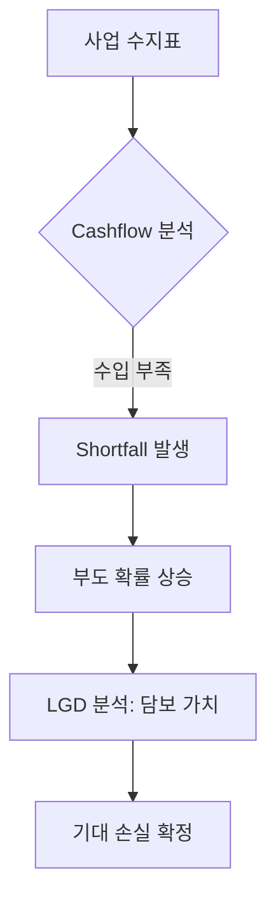

# PF 리스크 매핑 가이드 (PF Risk Mapping Guide)

## 🔥 목적

프로젝트 파이낸싱(PF) 자산의 리스크 구조를 표준화된 PD, LGD, EAD 프레임워크로 변환하는 기준을 정의합니다. 
PF는 사업성이 핵심인 **'현금흐름 기반 구조화 신용 리스크'**로 분류됩니다.

### ─────────────

## 📌 매핑 매커니즘 (Mapping Mechanism)

PF 리스크는 건설 단계별 사업성 지표와 현금수지 분석을 통해 산출됩니다.

👉 **사업 성공 = 현금흐름 발생 = 부도 회피**

### 리스크 변수 매핑 테이블

| 구분 | PF 리스크 요인 | 통합 모델 변수 (Standard) |
| :--- | :--- | :--- |
| **사업성** | 분양율, 공정률, 인허가 상태 | **PD (부도확률)** |
| **담보력** | LTV, 시공사 신용공여, 신탁 구조 | **LGD (손실률)** |
| **규모** | 현재 대출 잔액 + 미인출 한도 | **EAD (익스포저)** |

### ─────────────

## 🧠 리스크 전이 구조

PF 리스크는 사업 단계에 따라 선형적으로 전이됩니다.

### 단계별 리스크 전이
1. **토지 확보 및 인허가**: 토지 대금 Cashflow 리스크 (High PD)  
2. **착공 및 분양**: 공사비 집행 및 분양수입 Cashflow (Execution Risk)  
3. **준공 및 입주**: 잔금 회수 및 대출 상환 (Full Recovery)  

### ─────────────

## 💰 Cashflow 관점

PF 리스크는 예정된 현금 수지표(Cashflow Map)의 실현 가능성을 모니터링하는 작업입니다.

### ─────────────

## 📊 핵심 리스크 요인

### 분양 리스크
- 분양수입금의 유입 속도와 규모가 대출 상환에 미치는 영향 분석

### 준공 리스크
- 시공사 부실 또는 공사 지연으로 인한 현금 유입 시점의 미스매칭

### 금융 리스크
- 금리 상승 및 리파이낸싱 실패로 인한 금융 비용 증대

### ─────────────

## 🔗 연결

- [통합 리스크 프레임워크](../01_Unified_Risk_Framework.md)
- [포지션 (Position)](../01_Core_Model/Position.md)
- [PF 기초 지식](../../03_Assets_Verticals/PF/Basics.md)
- [기대손실 산출 (EL Calculation)](../03_Risk_Calculation/EL_Calculation.md)

### ─────────────

*최종 업데이트: 2026-04-14*