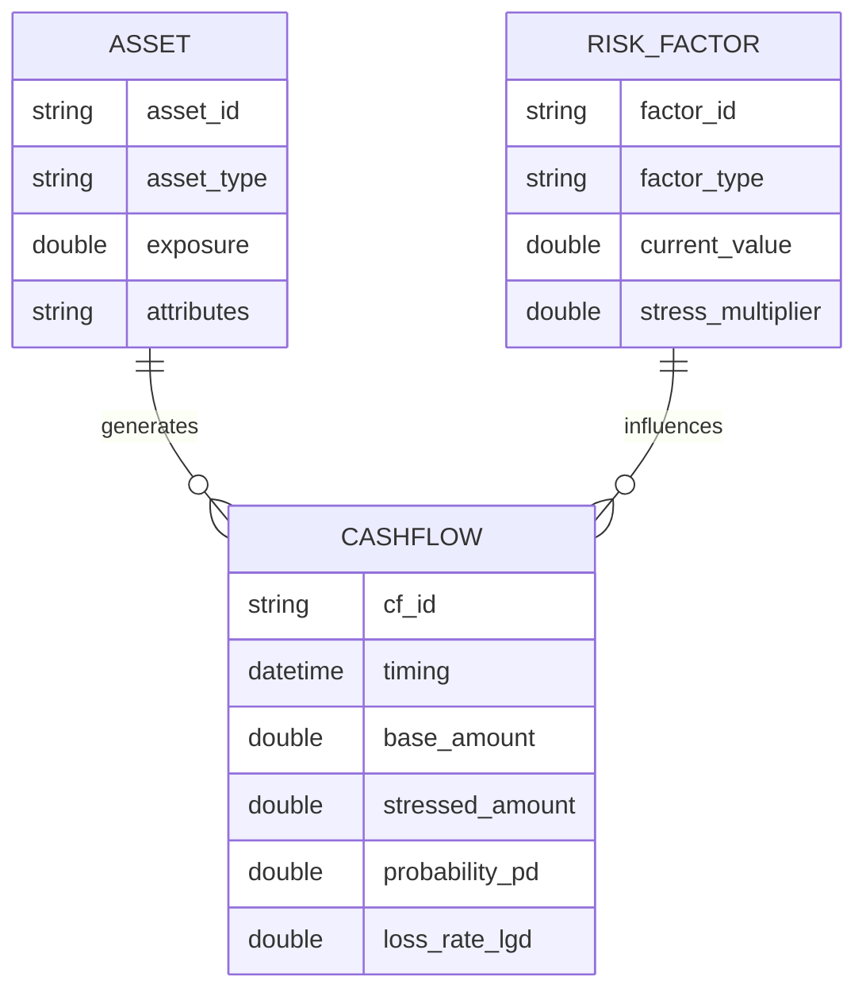

# 리스크 엔진 기술 사양 (Risk Engine Technical Specification)

본 문서는 통합 리스크 모델을 시스템적으로 구현하기 위한 데이터 아키텍처와 엔진의 논리적 워크플로우를 기술합니다.

## 1. 리스크 데이터 모델 아키텍처 (Data Model)

엔진의 논리적 구조는 데이터의 성격과 역할에 따라 세 가지 핵심 모델로 분리되어 설계됩니다. 이는 시스템의 모듈성을 확보하고 자산과 리스크 요인 간의 유가적 매핑을 지원하기 위함입니다.

- **Asset (자산)**: 분석 대상의 정적 데이터(Static Data). 자산 유형별 고유 식별 정보와 **EAD** 산출의 기초 속성을 포함합니다.
- **RiskFactor (리스크 요인)**: 현금흐름의 변동성을 유발하는 동인(Risk Driver). 금리, 경기 지수 등 상황(Scenario)에 따라 자산의 파라미터를 조정합니다.
- **Cashflow (현금흐름)**: 엔진의 최종 출력 모델. 자산 속성과 리스크 요인이 결합되어 산출되는 시점별 현금 유입/유출 구조이자 리스크 변수가 반영된 ‘불확실성 분포’입니다.

## 2. 엔진 리스크 산출 워크플로우 (Pipeline)

개별 자산 데이터가 최종 포트폴리오 리스크 지표로 변환되는 알고리즘 프로세스는 4단계로 구성됩니다.

1. **Step 1 (Ingestion)**: 자산별 기초 데이터 및 거시 경제 리스크 요인을 로드합니다.
2. **Step 2 (Standardization)**: 자산별 매핑 로직을 통해 데이터를 **PD/LGD/EAD** 규격으로 변환합니다. (예: NPL의 PD 100% 강제 등)
3. **Step 3 (Simulation)**: 지정된 시나리오별 승수와 **상관관계 행렬 (Correlation Matrix)**을 결합하여 PD/LGD 파라미터를 조정하고 시나리오별 현금흐름 분포를 생성합니다.
4. **Step 4 (Aggregation)**: 생성된 분포를 포트폴리오 단위로 통합 집계하여 최종 리스크 지표(예상 손실액, VaR 등)를 산출합니다.

## 3. 등급 맵핑 (Risk Grading Scale)

산출된 점수는 다음 금융권 등급 체계에 따라 맵핑됩니다.

| 점수 범위 | 등급 (Grade) | 상태 (Status) |
| :--- | :--- | :--- |
| **0 - 20** | **AAA ~ AA** | **안전 (Safe)** |
| **21 - 40** | **A ~ BBB** | **주의 (Warning)** |
| **41 - 60** | **BB ~ B** | **경고 (Caution)** |
| **61 - 100** | **CCC ~ D** | **위험 (High Risk)** |

---
*최종 수정일: 2026-04-11*
*참조: ib-mna-engine/Phase 4, 통합 리스크 산출 엔진 논리 설계 명세서*
