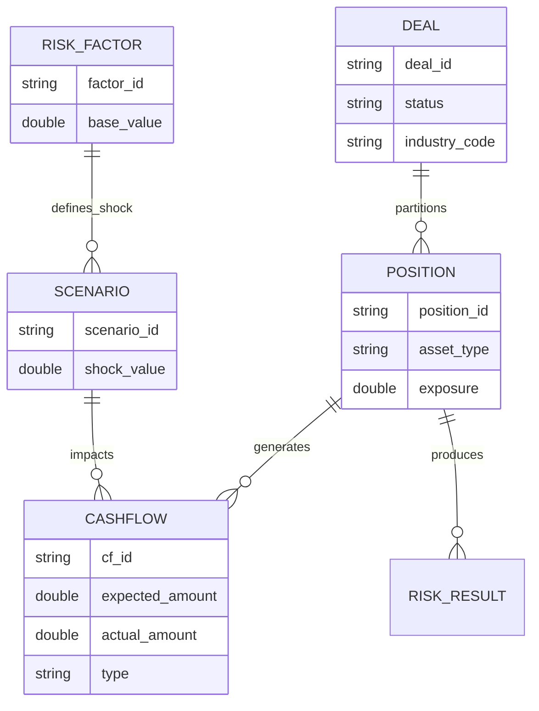

# 리스크 엔진 기술 사양 (Risk Engine Technical Specification)

## 🔥 목적

본 문서는 통합 리스크 모델을 시스템적으로 구현하기 위한 데이터 아키텍처와 엔진의 논리적 워크플로우를 기술합니다. 물리적 스키마 설계와 엔진 로직 구현의 가교 역할을 수행합니다.

### ─────────────

## 📌 1. 리스크 데이터 모델 아키텍처 (Data Model)

엔진의 논리적 구조는 데이터의 계층과 역할에 따라 분리 설계됩니다. 이는 시스템의 모듈성을 확보하고 자산과 리스크 요인 간의 동적 매핑을 지원하기 위함입니다.

### 설계 아키텍처 다이어그램

### 데이터 레이어 설명
- **Master Layer (Deal/Position)**: 분석 대상의 정적 데이터. 자산 유형별 고유 식별 정보와 **EAD** 산출의 기초가 되는 포지션 정보를 포함합니다.
- **Factor Layer (Risk Factor/Scenario)**: 현금흐름의 변동성을 유발하는 동인(Driver). 실측된 시장 데이터에 시나리오별 충격(Shock)을 가하여 시뮬레이션 파라미터를 생성합니다.
- **Execution Layer (Cashflow)**: 엔진의 핵심 처리 모델. 자산 속성과 시나리오 충격이 결합되어 산출되는 시점별 현금 유입/유출 구조입니다.

### ─────────────

## 🧠 2. 엔진 리스크 산출 워크플로우 (Pipeline)

개별 자산 데이터가 최종 포트폴리오 리스크 지표로 변환되는 프로세스는 4단계로 구성됩니다.

### 👉 Step 1. Ingestion (데이터 로드)
- 마스터 데이터(Deal, Position) 및 거시 경제 리스크 요인(Risk Factor)을 로드합니다.
- Snapshot 기준일(`as_of_date`)에 따른 데이터 일관성을 확보합니다.

### 👉 Step 2. Mapping & Standardization (규격화)
- 자산별 매핑 로직을 통해 데이터를 **PD/LGD/EAD** 규격으로 변환합니다. 
- 예: NPL의 경우 PD를 100%로 강제 매핑하고 회수 시나리오를 LGD로 전환합니다.

### 👉 Step 3. Simulation & Shock (시뮬레이션)
- 시나리오별 충격치(Shock)를 현금흐름에 투영합니다.
- 상관관계 행렬(Correlation Matrix)을 결합하여 PD/LGD 파라미터를 조정하고 시나리오별 불확실성 분포를 생성합니다.

### 👉 Step 4. Aggregation & Reporting (집계)
- 생성된 분포를 포지션 -> 딜 -> 포트폴리오 단위로 통합 집계합니다.
- 최종 리스크 지표(EL, Stress Loss, VaR 등)를 산출하고 등급을 부여합니다.

### ─────────────

## ⚖️ 3. 등급 맵핑 (Risk Grading Scale)

산출된 리스크 점수 또는 손실률은 다음 등급 체계에 따라 자동 매핑됩니다.

### 리스크 등급표

| 점수 범위 | 등급 (Grade) | 상태 (Status) |
| :--- | :--- | :--- |
| **0 - 20** | **AAA ~ AA** | **안전 (Safe)** |
| **21 - 40** | **A ~ BBB** | **주의 (Warning)** |
| **41 - 60** | **BB ~ B** | **경고 (Caution)** |
| **61 - 100** | **CCC ~ D** | **위험 (High Risk)** |

### ─────────────

## 🔗 연결

- [통합 리스크 프레임워크](./01_Unified_Risk_Framework.md)
- [데이터 스키마 정의](./05_Data_Model/01_Schemas/Position_Schema.md)

### ─────────────

*최종 업데이트: 2026-04-14*
*참조: ib-mna-engine 구현 가이드 v2.0*
