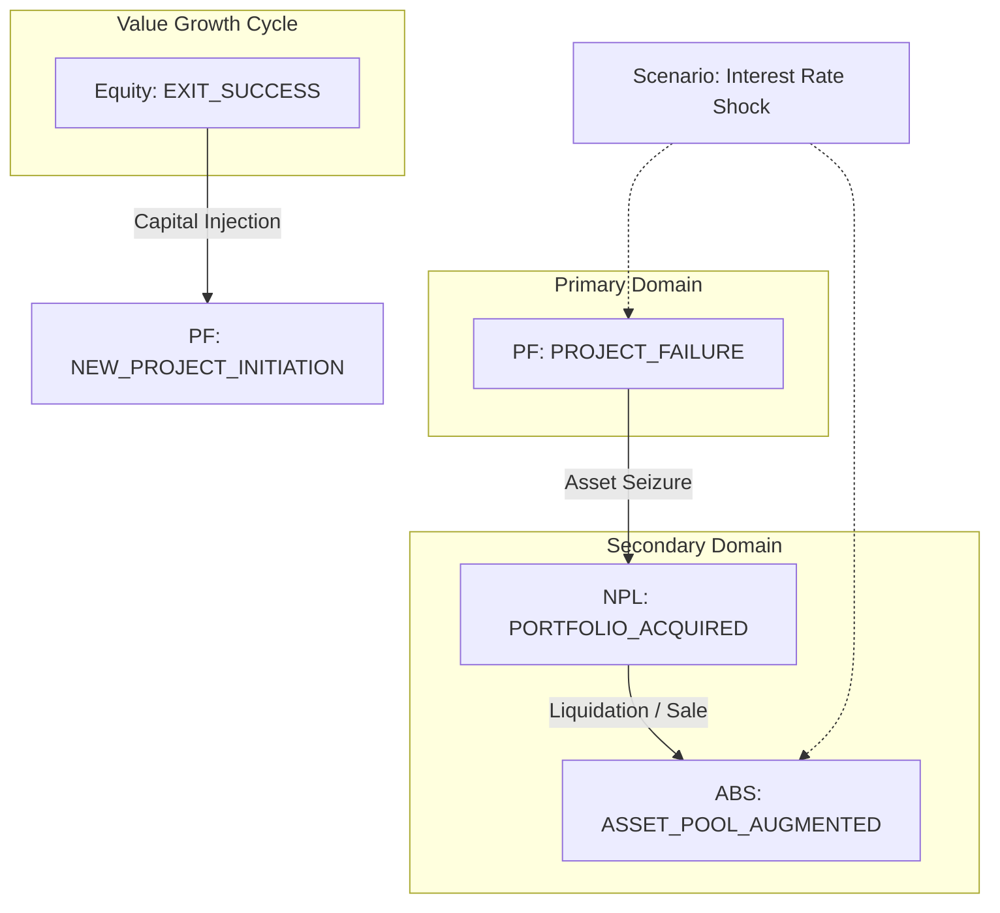

# IB 통합 리스크 전파 명세 (Integrated Risk Causality Spec)

## 1. 개요 (Overview)
본 문서는 거시 시나리오가 각 자산 도메인에 미치는 전파 경로와, 도메인 간의 이벤트 인과관계(Event Causality)를 정의합니다. 이를 통해 개별 자산의 리스크가 전체 IB 생태계로 전이되는 메커니즘을 명세화합니다.

---

## 2. Integrated Stress Scenario Catalog
전 도메인에 동시 영향을 미치는 거시 시나리오 정의입니다.

| ID | 시나리오 명칭 | 정의 (Macro Context) | 주요 트리거 이벤트 (Call Events) |
| :--- | :--- | :--- | :--- |
| **S1** | **Interest Rate Shock** | 기준 금리 폭등 및 조달 스프레드 확대 | PF.`FUNDING_FAILURE`, ABS.`CASH_TRAP`, Equity.`MTM_SHOCK` |
| **S2** | **Real Estate Crash** | 분양 시장 마비 및 담보 가치 폭락 | PF.`PRE_SALE_SHORTFALL`, NPL.`AUCTION_FAILURE`, ABS.`COLLATERAL_DEVALUED` |
| **S3** | **Liquidity Crunch** | 자본시장 유동성 증발 및 엑시트 불가 | ABS.`REFINANCING_FAILURE`, Equity.`EXIT_DELAYED`, NPL.`COLLECTION_DIP` |

### 가. Sector Scenario (산업별 시나리오)
| ID | 시나리오 명칭 | 정의 | 주요 트리거 이벤트 |
| :--- | :--- | :--- | :--- |
| **S4** | **Semiconductor Shock** | 글로벌 공급망 붕괴 및 반도체 수요 급감 | Equity.`VALUATION_SHOCK`(Tech), NPL.`COLLECTION_DELAY`(SME) |

### 나. Idiosyncratic Scenario (개별 기업 시나리오)
| ID | 시나리오 명칭 | 정의 | 주요 트리거 이벤트 |
| :--- | :--- | :--- | :--- |
| **S5** | **Key Builder Default** | 10대 대형 시공사의 부도 및 워크아웃 | PF.`COMPLETION_RISK_TRIGGER`, ABS.`GUARANTEE_DEFAULT` |

---

## 3. Event Dependency Graph (도메인 간 인과관계)

특정 도메인의 이벤트 발생이 후행 도메인의 이벤트를 트리거하는 리스크 전파 그래프입니다.

---

## 4. Data Transfer Point (데이터 전이 지점)
이벤트 전이 시 도메인 간에 전달되는 핵심 데이터 사양입니다.

### PF -> NPL (부실 전이)
- **전이 데이터**: `Uncollected Principal`, `Collateral Appraisal`, `Default Date`.
- **논리**: PF의 `Loss` 확정 데이터가 NPL의 매입 원리금(`OPB`) 및 회수 목표가로 전환됩니다.

### NPL -> ABS (유동성 공급)
- **전이 데이터**: `Recovery Cashflow Table`, `Tranche Structure`, `Waterfall Priority`.
- **논리**: NPL 포트폴리오의 예상 회수 스케줄이 ABS의 기초자산 현금흐름으로 매핑됩니다.

---

## 🔗 연결
- [Core Ontology Definitions](../00_Standard_Layer/Core_Definitions.md)
- [Unified Risk Framework](./01_Unified_Risk_Framework.md)
- [Assets Verticals Mapping](../03_Assets_Verticals/)

### ─────────────

*최종 업데이트: 2026-04-16 (이벤트 기반 전파 구조 명세화)*
