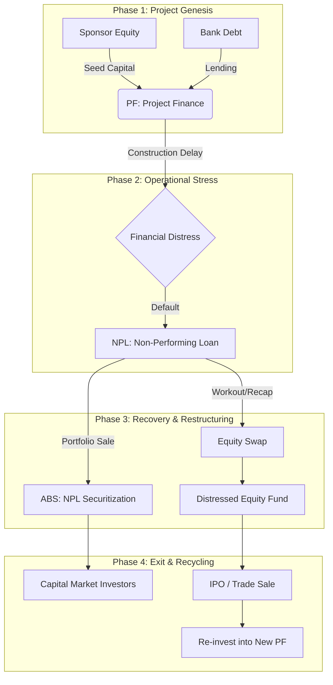

# IB Integration Synthesis Map

This document illustrates how **NPL, PF, Equity, and ABS** intersect to form a comprehensive Investment Banking ecosystem.

## 1. The Integrated Lifecycle

The following diagram shows the lifecycle of a large-scale asset (e.g., a Power Plant Project) and how it transitions through different IB domains.

## 2. Cross-Asset Synergy Points

### A. PF -> NPL (The Distress Bridge)
When a project fails to meet DSCR (Debt Service Coverage Ratio) requirements, it moves from a PF asset to an NPL. IB's role transitions from *Structuring* to *Restructuring*.

### B. NPL -> ABS (The Liquidity Bridge)
To clean up balance sheets, banks bundle NPLs into ABS tranches. This allows institutional investors to "buy" into recovery potential with different risk-return profiles.

### C. Equity -> PF (The Growth Bridge)
Equity capital is the primary engine for starting new PF projects. Successful exits in one domain provide the liquidity needed for the next cycle.

### D. ABS -> PF (The Debt Bridge)
ABS mechanisms (like CLOs) are used to provide the underlying debt capital for PF projects, creating a continuous loop of funding.

---
*Created: 2026-04-10*
