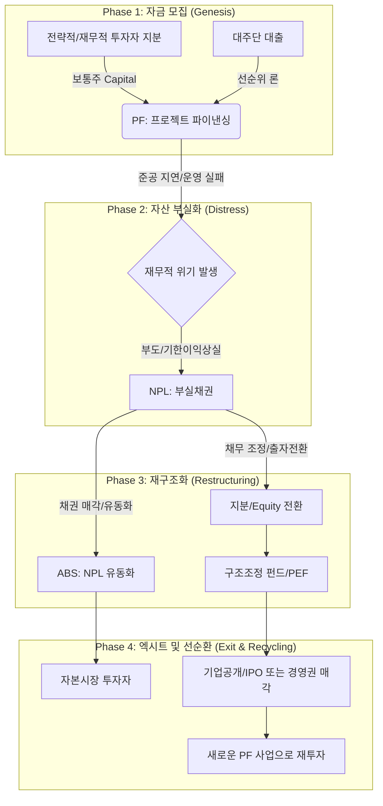

# IB 통합 시너지 맵 (Integrated IB Synthesis Map)

이 문서는 **NPL, PF, Equity, ABS**가 어떻게 서로 교차하며 종합적인 투자은행(IB) 생태계를 형성하는지 보여줍니다.

## 1. 자산 라이프사이클 통합 (Integrated Lifecycle)

아래 다이어그램은 대규모 자산(예: 발전소 건설 프로젝트)이 라이프사이클에 따라 각 IB 도메인을 어떻게 거쳐가는지 설명합니다.

## 2. 도메인별 시너지 포인트 (Cross-Asset Synergy)

### 가. PF -> NPL (부실 전이 지점)
프로젝트가 **DSCR (부채상환계수)** 요건을 충족하지 못하면, 해당 자산은 일반 대출에서 NPL로 분류됩니다. 이 시점부터 IB의 역할은 '구조화 (Structuring)'에서 '재구조화 (Restructuring)'로 전환됩니다.

### 나. NPL -> ABS (유동성 공급 지점)
은행의 건전성 제고를 위해 NPL 포트폴리오는 ABS 형태로 유동화됩니다. 이를 통해 기관 투자자들은 위험도별로 분산된 트랜치에 투자하여 회수 이익을 공유합니다.

### 다. Equity -> PF (성장 엔진 지점)
지분 자본(Equity)은 새로운 PF 프로젝트를 시작하는 원동력이 됩니다. 한 도메인에서의 성공적인 **엑시트 (Exit)**는 다음 사이클을 위한 유동성을 제공합니다.

### 라. ABS -> PF (자금 조달 지점)
ABS 메커니즘(예: PF 대출 채권을 기초로 한 ABCP)은 PF 프로젝트의 선순위 대출 자금을 공급하며 금융의 연속성을 보장합니다.

## 4. 관련 문서 (Related Documents)
- **통합 리스크 프레임워크**: [01_Unified_Risk_Framework.md](file:///home/kbgkim/antigravity/projects/ib_wiki/src/02_Integrated_IB/01_Unified_Risk_Framework.md) - 전 자산 통합 리스크 이론.
- **IB 기본 개요**: [IB_Overview.md](file:///home/kbgkim/antigravity/projects/ib_wiki/src/01_Foundations/IB_Overview.md) - 투자은행 기능 및 가치 사슬 개요.

### 상세 자산별 기초 (Asset Verticals)
- **부실채권**: [NPL Basics](file:///home/kbgkim/antigravity/projects/ib_wiki/src/03_Assets_Verticals/NPL/Basics.md)
- **프로젝트 파이낸싱**: [PF Basics](file:///home/kbgkim/antigravity/projects/ib_wiki/src/03_Assets_Verticals/PF/Basics.md)
- **자산유동화**: [ABS Basics](file:///home/kbgkim/antigravity/projects/ib_wiki/src/03_Assets_Verticals/ABS/Basics.md)
- **자본/지분**: [Equity Basics](file:///home/kbgkim/antigravity/projects/ib_wiki/src/03_Assets_Verticals/Equity/Basics.md)

---
*최종 수정일: 2026-04-11*
