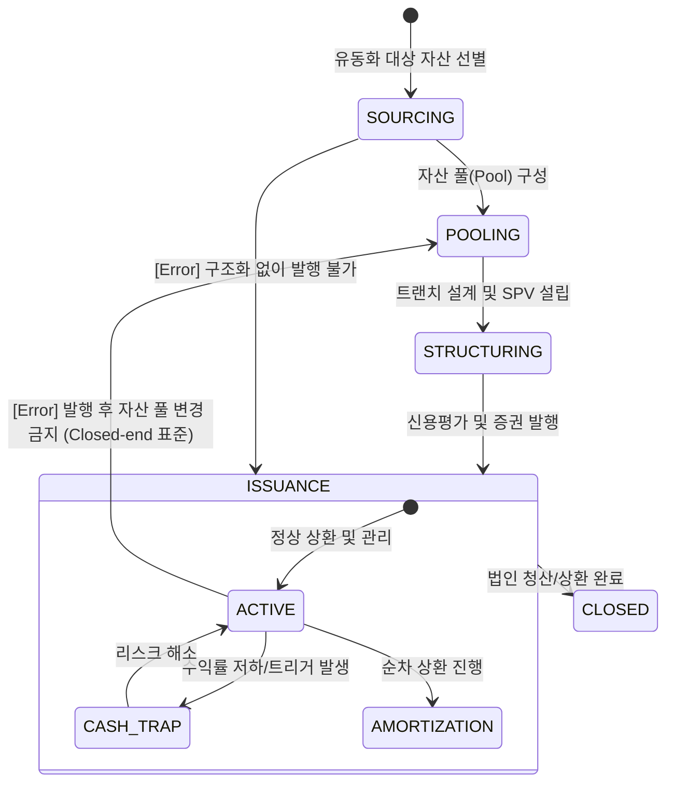

# ABS 라이프사이클 및 이벤트 모델 명세

## 1. 개요 (Overview)
본 문서는 ABS(자산유동화) 딜의 생애주기를 상태 전이(State Transition)와 비즈니스 이벤트(Event) 관점에서 정의합니다. 자산의 법적 절연(True Sale)과 트랜치별 신용 분리에 따른 리스크 변화를 추적하며, **이벤트 정합성 검증(Validation Layer)**을 통해 설계의 완결성을 확보합니다.

---

## 2. State Machine (상태 전이 모델)

ABS 딜의 상태는 자산 풀링과 유동화 증권 발행 단계에 따라 다음과 같이 전이됩니다.

---

## 3. Full Event Catalog & Validation Layer

모든 이벤트는 정합성 검증 규칙을 준수해야 합니다.

| Event Name | Pre-condition (필수 상태/데이터) | Trigger Condition | Post-state | Invalid Transition |
| :--- | :--- | :--- | :--- | :--- |
| **POOL_FINALIZED** | `SOURCING` / `Asset_List` 존재 | 유동화 대상 채권 리스트 확정 | `POOLING` | `ISSUANCE`로의 직접 전이 |
| **TRUE_SALE_SIGNED** | `POOLING` / `Legal_Opinion` | 자산 양도 계약 및 대금 지급 | `STRUCTURING` | `SOURCING` 상태에서 발생 |
| **SECURITIES_ISSUED** | `STRUCTURING` / `Credit_Rating` | 유동화증권 시장 매각 완료 | `ACTIVE` | `POOLING` 상태에서 직접 전이 |
| **CASH_TRAP_TRIGGER** | `ACTIVE` / `DSCR` 임계치 하달 | 연체율/부도율 임계치 초과 | `CASH_TRAP` | `SOURCING`, `CLOSED` 상태 |
| **UPGRADE_ENHANCEMENT**| `STRUCTURING` or `ACTIVE` | 외부 보증 추가 또는 담보 보강 | `ACTIVE` (Enhanced) | `CLOSED` 상태에서 발생 |
| **REDEMPTION_FINAL** | `AMORTIZATION` / `Zero_Balance` | 최종 트랜치 상환 완료 | `CLOSED` | `POOLING` 상태에서 직접 전이 |

---

## 4. 리스크 전이 논리 (Event Logic)

### 가. 정합성 검증 규칙 (Validation Rules)
1. **자산 확정성 (Static Pool)**: `ISSUANCE` 상태에 진입한 이후에는 `POOL_FINALIZED` 이벤트를 재호출하여 자산 구성을 변경할 수 없음 (추가 유동화 제외).
2. **트리거 배타성**: `CASH_TRAP` 상태에서는 `AMORTIZATION`(순차 상환) 이벤트가 중단되며, 모든 현금흐름은 리저브 계좌로 유보됨.
3. **법적 절연 우선**: `SECURITIES_ISSUED` 이벤트는 반드시 `TRUE_SALE_SIGNED` 이벤트의 Post-state가 확인된 후에만 트리거 가능.

---

## 🔗 연결
- [ABS 도메인 기초 및 명세](./Basics.md)
- [ABS 리스크 매핑 가이드](./ABS_Mapping.md)

### ─────────────

*최종 업데이트: 2026-04-16 (논리적 정합성 규칙 강화)*
