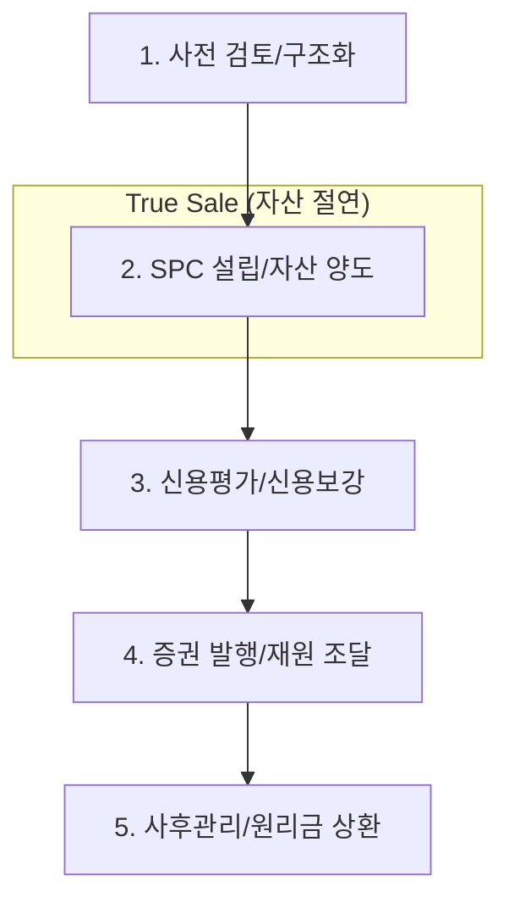

# ABS 딜 라이프사이클 및 북킹 가이드 (ABS Deal Lifecycle & Booking)

## 🔥 목적

본 문서는 대출채권 유동화(ABS)의 구조화(Structuring)부터 증권 발행, 사후 관리 및 시스템 북킹 표준을 정의합니다.

### ─────────────

## 📌 1. 전 과정 업무 흐름도 (End-to-End Flow)

ABS는 자산보유자의 신용과 분리된 별도의 현금흐름 체계를 구축하는 과정입니다.

### 업무 프로세스 시각화

### ─────────────

## ⚙️ 2. 단계별 상세 가이드

### Phase 1. 사전 검토 및 구조화 (Structuring)
- **대상 자산 분석**: 유동화 자산 풀(Pool) 선정, 채권 회수 가능성, 신용/법률 리스크 분석.
- **구조 설계**: 고객 요구에 맞춘 만기, 금리, 상환 구조 및 신용보강 방식 설계.
- **관계기관 선정**: 주관사, 신용평가사, 법률고문, 수탁기관 선정 후 킥오프 미팅.

### Phase 2. SPC 설립 및 자산 양도 (SPC & Asset Transfer)
- **SPC 설립**: 유동화 자산을 보유자와 분리하기 위한 페이퍼컴퍼니 설립.
- **진정한 양도 (True Sale)**: 자산유동화법 제13조에 따라 보유자 파산 시에도 기초자산이 파산재단에 편입되지 않도록 법적 절연.
- **4대 성립 요건**: 1. 매매 또는 교환일 것, 2. 수익권/처분권의 완전한 이전, 3. 반환청구권의 부재, 4. 양수인의 위험 인수.

### Phase 3. 신용평가 및 신용보강 (Rating & Enhancement)
- **신용평가**: 평가기관이 현금흐름 및 자산 건전성을 분석하여 증권 등급 산정.
- **신용보강**: 높은 등급(AAA 등)을 얻기 위한 내부(선/후순위, 초과담보) 및 외부(채무보증, 매입확약) 장치 마련.

### Phase 4. 유동화 증권 발행 및 자금 조달 (Issuance & Funding)
- **유가증권 신고**: 금융감독원에 발행 신고서 제출 및 승인.
- **투자자 모집**: 기관/개인 투자자에게 증권 판매 및 자금 유입.
- **매각대금 지급**: SPC가 조달한 자금으로 원 자산보유자에게 양도 대금 지급.

### IMPORTANT: 2024 개정 자산유동화법 반영
1. **위험보유 의무(Risk Retention)**: 이해상충 방지를 위해 유동화증권 발행 잔액의 **5%를 의무 보유**해야 합니다.
2. **정보공개 강화**: 비등록 유동화증권도 발행 내역을 예탁결제원 **e-SAFE 시스템**에 의무적으로 공개해야 합니다.

### Phase 5. 사후관리 및 상환 (Post-closing & Servicing)
- **자산관리자(Servicer) 업무**: 채권 원리금 수납, 채무자 관리, 연체 관리 대행.
- **원리금 상환**: 자산에서 발생하는 현금흐름으로 **워터폴(Waterfall)** 우선순위에 따라 투자자 상환.

### ─────────────

## 📊 3. 유동화 증권 유형 비교 (Comparison)

| 구분 | ABS (증권) | ABCP (어음) | ABL (대출) |
| :--- | :--- | :--- | :--- |
| **형태** | 장기 채권 | 단기 기업어음 | SPC 차입금 (대출) |
| **만기** | 주로 1년 이상 | 주로 3개월 (차환 필요) | 대출 계약 기간 |
| **핵심 리스크** | 신용 위험 | **유동성(차환) 위험** | 담보 가치 하락 위험 |
| **실무 특징** | 공시 의무 높음 | 신속한 조달, 증권사 확약 필수 | 절차 간소, 보안 유리 |

### ─────────────

## 📂 4. 실무 북킹 정보 표준 (Booking Information)

### 가. 기초자산 정보 (Underlying Asset)
- **자산 식별**: 대출계약번호, 차입자명, 실행일/만기일.
- **원리금 현황**: 개시원금잔액(**OPB**), 적용금리, 이자계산방식.
- **담보/건전성**: 부동산 소재지, 감정평가액, 최신 **LTV**, 연체 여부.

### 나. 유동화증권 발행 정보 (Issuance)
- **구조 정보**: 트랜치 구성(선/중/후순위 비중), 상환 우선순위 로직(**Waterfall**).
- **발행 조건**: 증권종류(ABS, ABCP, ABL), 발행가액, 표면금리(쿠폰), 만기구조.
- **신용보강**: 매입확약/보장 기관 명칭, **시공사 책임준공** 여부, 신용공여 한도.

### ─────────────

## 🔗 연결

- [자산유동화 기초 (ABS Basics)](Basics.md)
- [리스크 엔진 기술 사양](../../02_Integrated_IB/02_Risk_Engine_Tech_Spec.md)

### ─────────────

*최종 업데이트: 2026-04-14*
