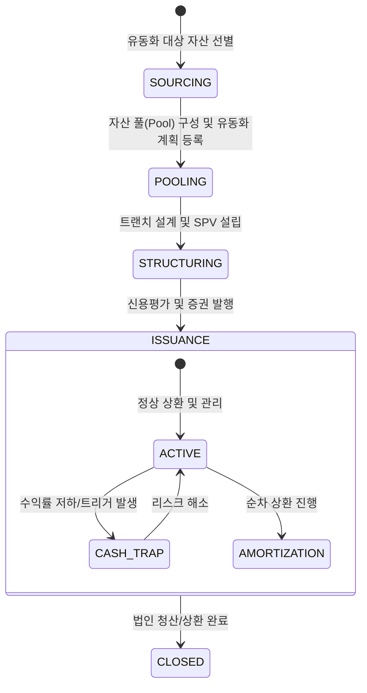

# ABS 라이프사이클 및 이벤트 모델 명세

## 1. 개요 (Overview)
본 문서는 ABS(자산유동화) 딜의 생애주기를 상태 전이(State Transition)와 비즈니스 이벤트(Event) 관점에서 정의합니다. 자산의 법적 절연(True Sale)과 트랜치별 신용 분리에 따른 리스크 변화를 추적하는 것이 핵심입니다.

---

## 2. State Machine (상태 전이 모델)

ABS 딜의 상태는 자산 풀링과 유동화 증권 발행 단계에 따라 다음과 같이 전이됩니다.

---

## 3. Event Catalog (비즈니스 이벤트 명세)

도메인 내에서 발생하는 핵심 이벤트와 그에 따른 구조적 영향입니다.

| Event Name | Trigger (발생 조건) | Impact Factor (영향) | Extension Layer 연동 |
| :--- | :--- | :--- | :--- |
| **POOL_FINALIZED** | 유동화 대상 채권 리스트 확정 | **Value**: 기초자산 Cashflow 총량 확정 | 자산 건전성 필터링 |
| **TRUE_SALE_SIGNED** | 자산 양도 계약 및 대금 지급 | **Risk**: 보유자 파산 리스크 절연 완료 | 법적 절연(True Sale) 유효성 |
| **CREDIT_ENHANCED** | 외부 보증 또는 내부 보강 확정 | **Risk**: 중/선순위 LGD 하향 조정 | 신용보강(Enhancement) 유형 |
| **SECURITIES_ISSUED** | 유동화증권 시장 매각 완료 | **Value**: 조달 자본 유입 및 수수료 실현 | STO(선택적) 발행 이벤트 |
| **TRIGGER_EVENT** | 연체율/부도율 임계치 초과 | **Risk**: 후순위 손실 흡수 및 워터폴 정지 | 리스크 트리거(Trigger) 관리 |
| **REDEMPTION_COMPLETED**| 최종 트랜치 상환 및 SPV 해산 | **Value**: 딜 종료 및 잔여 이익 귀속 | Exit 가치 정산 |

---

## 4. Phase별 구조 상세 (Core vs Extension)

### Phase 1. 자산 구성 및 구조화 (Core)
- **핵심 행위**: 자산 풀링, 트랜칭(Senior/Junior) 설계.
- **이벤트**: `POOL_FINALIZED`, `TRUE_SALE_SIGNED`.
- **Extension**: STO 발행 시 토큰화 규격 정의.

### Phase 2. 신용보강 및 발행 (Core)
- **핵심 행위**: 트랜치별 신용등급 부여, 신용보강 장치 작동.
- **이벤트**: `CREDIT_ENHANCED`, `SECURITIES_ISSUED`.
- **Extension**: 외부 신용공여(Guarantee) 계약 구조 연결.

### Phase 3. 사후관리 및 상환 (Core)
- **핵심 행위**: 실시간 Waterfall 상환, 리스크 트리거 모니터링.
- **이벤트**: `TRIGGER_EVENT`, `REDEMPTION_COMPLETED`.

---

## 🔗 연결
- [ABS 도메인 기초 및 명세](./Basics.md)
- [ABS 리스크 매핑 가이드](./ABS_Mapping.md)

### ─────────────

*최종 업데이트: 2026-04-16 (이벤트 기반 구조 반영)*
