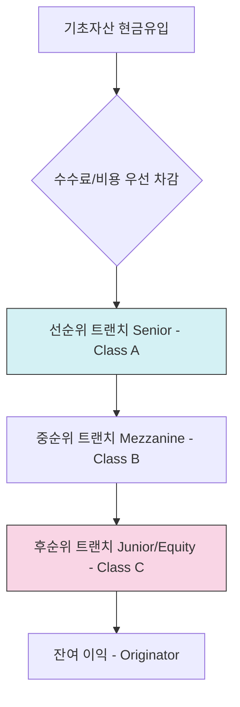

# 자산유동화 (Asset-Backed Securities, ABS) 기초

자산유동화(ABS)는 부동산, 매출채권, 주택담보대출 등 유동성이 낮은 자산을 기초로 증권을 발행하여 자산 보유자가 자금을 조달하는 금융 기법입니다.

## 1. ABS의 핵심 구조: 트랜칭 (Tranching)

ABS는 기초자산에서 발생하는 현금흐름을 위험 선호도에 따라 여러 계층(**Tranche**)으로 나눕니다. 이를 통해 서로 다른 신용등급과 수익률을 가진 증권들을 동시에 발행할 수 있습니다.

### 신용 워터폴 (Credit Waterfall) 아키텍처
기초자산에서 유입되는 현금은 아래의 우선순위에 따라 폭포수처럼 배분됩니다.

| 트랜치 계층 | 신용 등급 | 상환 우선순위 | 리스크/수익 | 손실 흡수 역할 |
| :--- | :--- | :--- | :--- | :--- |
| **선순위 (Senior)** | **AAA ~ AA** | **1순위** | 낮음 / 안전 | 최후의 보루 |
| **중순위 (Mezzanine)** | **A ~ BBB** | **2순위** | 중간 / 보통 | 1차 방어선 붕괴 시 노출 |
| **후순위 (Junior/Equity)** | **NR (미부여)** | **최후순위** | 높음 / 고수익 | **제1순위 손실 흡수 (First Loss)** |

## 2. 수치 시뮬레이션: 리스크 전이 예시 (Numerical Scenario)

구조화 금융의 '리스크 차단' 효과를 이해하기 위해 다음 가상 포트폴리오를 가정합니다.

*   **기초자산**: 1,000억 원 (AUM)
*   **선순위 (80%)**: 800억 원 / **중순위 (10%)**: 100억 원 / **후순위 (10%)**: 100억 원

| 시나리오 | 기초자산 손실액 | 후순위 (100억) | 중순위 (100억) | 선순위 (800억) | 결과 분석 |
| :--- | :---: | :---: | :---: | :---: | :--- |
| **정상 (Base)** | 0억 | 100억 보전 | 100억 보전 | 800억 보전 | 전원 수익 달성 |
| **경미 (Stress)** | **50억 (-5%)** | **50억 손실** | 100억 보전 | 800억 보전 | 후순위가 선/중순위 보호 |
| **심각 (Crisis)** | **150억 (-15%)** | **전액 손실** | **50억 손실** | 800억 보전 | 후/중순위 붕괴, 선순위 보전 |
| **재앙 (Worst)** | **300억 (-30%)** | 전액 손실 | 전액 손실 | **100억 손실** | 선순위 원금 일부 잠식 |

> [!IMPORTANT]
> **신용 보강 (Credit Enhancement)**: 위 예시에서 후순위와 중순위가 차지하는 20%의 두께가 선순위 투자자에게는 '20%의 손실까지는 내 원금이 안전하다'는 확신을 주는 **신용 보강** 장치가 됩니다.

## 3. 실무적 확장: 만기별 순차 상환 (Sequential Pay)
신용 워터폴 외에도 현금흐름을 **시간(만기)**에 따라 나누기도 합니다.
-   **Sequential Pay**: 짧은 만기(Class A1)가 다 갚아질 때까지 긴 만기(Class A3)는 이자만 받고 대기하는 방식입니다. 이를 통해 투자자의 자금 운용 기간(Duration) 요구를 충족시킵니다.

## 4. 국내 실무 사례
-   **주택금융공사(KHFC) MBS**: 주택저당채권을 유동화하며, 공사가 대부분의 후순위 채권을 보유하여 선순위 투자자의 안정성을 보강합니다.
-   **수익차등형 펀드**: 증권사(운용사)가 후순위로 참여하여 손실을 먼저 흡수하고, 개인 투자자가 선순위로 참여하여 하방 리스크를 제한하는 구조입니다. (현업: **`손익차등형`**)

## 5. 통합 리스크 프로필 (Unified Risk Profile)
ABS 리스크는 트랜치 구조에 의해 **LGD**가 극단적으로 결정됩니다.

-   **부도 확률 (PD)**: 기초자산(Underlying Asset) 전체의 부실 발생 확률과 연동.
-   **부도 시 손실률 (LGD)**: 
    -   선순위: **극히 낮음** (후순위가 완충 역할 수행)
    -   후순위: **거의 100%** (손실 발생 시 즉시 잠식됨)
-   **부도 시 노출액 (EAD)**: 각 트랜치별 실제 **투자 약정 금액**.

> [!NOTE]
> ABS의 현금흐름 안정성은 [리스크 엔진 기술 사양](../../02_Integrated_IB/02_Risk_Engine_Tech_Spec.md) 내 정규화 로직을 통해 상시 모니터링됩니다.

## 6. 관련 문서 (Related Documents)
- **통합 리스크 프레임워크**: [01_Unified_Risk_Framework.md](../../02_Integrated_IB/01_Unified_Risk_Framework.md) - PD/LGD/EAD 매핑 이론.
- **통합 시너지 맵**: [Synthesis_Map.md](../../02_Integrated_IB/Synthesis_Map.md) - 자산 간 연계 구조.
- **리스크 엔진 기술 사양**: [02_Risk_Engine_Tech_Spec.md](../../02_Integrated_IB/02_Risk_Engine_Tech_Spec.md) - 구조화 리스크 정규화 로직.

---
*최종 수정일: 2026-04-11*
