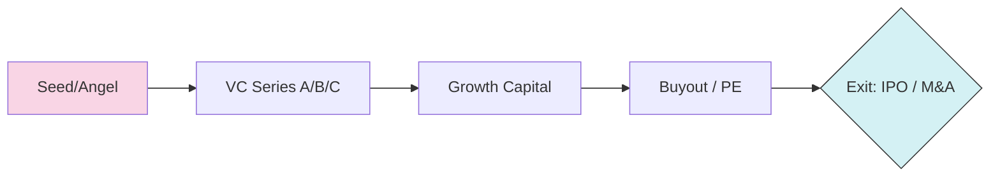

# 자본/지분 (Equity) 기초

Equity 투자는 기업의 지분을 취득하여 경영에 참여하거나, 기업 성장에 따른 가치 상승(Capital Gain) 및 배당 수익을 추구하는 투자 방식입니다. 자본 구조상 최하단에 위치하여 리스크가 가장 크지만, 이론적으로 무한한 수익(Unlimited Upside)이 가능합니다.

## 1. 투자 생애주기 (Investment Lifecycle)

기업의 성장 단계에 따라 투자의 성격과 리스크-수익 프로필이 변화합니다.

-   **VC (Venture Capital)**: 초기/성장기 기업에 투자. 높은 부도 확률(PD)을 소수의 대박 수익으로 상쇄.
-   **PE (Private Equity)**: 성숙기 기업의 경영권을 인수(**Buyout**)하여 가치를 제고한 후 매각.

## 2. 기업 가치평가 (Valuation Triangulation)

IB 실무에서는 한 가지 방법론에 의존하지 않고 여러 수치를 대조하는 **트라이앵귤레이션** 과정을 거칩니다.

| 방법론 | 분석 관점 | 핵심 지표 | 실무 용도 |
| :--- | :--- | :--- | :--- |
| **CCA (유사기업비교)** | 시장 상태 (Market) | EV/EBITDA, P/E | 상장 준비(IPO), 상대 가치 파악 |
| **PTA (과거거래비교)** | 경영권 프리미엄 | Transaction Multiple | M&A 인수 제안가 산정 |
| **DCF (현금흐름할인)** | 내재 가치 (Intrinsic) | FCF, WACC, g | 장기 투자, 본질 가치 분석 |
| **LBO (레버리지매수)** | 투자 수익률 (Floor) | Target IRR, Leverage | 사모펀드(PE)의 최대 매수가 산정 |

### 가치평가 민감도 분석 (Sensitivity Analysis)
DCF 평가 시 할인율(**WACC**)과 영구성장률(**g**)에 따른 기업 가치 변화 예시입니다. (단위: 억 원)

| WACC \ g | 1.0% | 1.5% (Base) | 2.0% |
| :--- | :---: | :---: | :---: |
| 9.0% | 1,200 | 1,350 | 1,500 |
| **10.0% (Base)** | 1,050 | **1,000** | 1,150 |
| 11.0% | 850 | 900 | 950 |

## 3. M&A 실무 프로세스와 리스크 관리

가치평가보다 중요한 것이 거래 과정에서의 리스크 식별입니다.

### 가. 실사 (Due Diligence, DD)
-   **재무 실사**: 숨겨진 부채, 분식 회계, 비정상적 일회성 이익 확인.
-   **법률 실사**: 소송 리스크, 핵심 계약의 체결 적정성, 지식재산권 소유권.
-   **현업 이슈**: 실사 결과에 따라 최종 매수가를 조정(**Price Adjustment**)하거나 거래를 철회합니다.

### 나. 주식매매계약 (SPA)
-   **진술 및 보장 (R&W)**: 판매자가 기업 상태에 대해 보증하며, 거짓일 경우 손해배상 책임을 짐.
-   **확약 (Covenants)**: 딜 클로징까지 기업 가치를 훼손하는 행위를 금지함.

## 4. 투자 성과 지표 (Performance Metrics)

-   **IRR (Internal Rate of Return)**: 시간 가치를 고려한 연환산 수익률. PE 투자의 핵심 벤치마크.
-   **MOIC (Multiple of Invested Capital)**: 투입 원금 대비 총 회수 금액의 배수. (예: 2.0x = 원금의 2배 회수)

## 5. 통합 리스크 프로필 (Unified Risk Profile)
Equity는 자본 구조의 최후순위로서 모든 부채(Debt)가 상환된 후에만 가치를 가집니다.

-   **부도 확률 (PD)**: 기업 파산 및 상장 폐지 확률.
-   **부도 시 손실률 (LGD)**: **거의 100%**. 부채 상환 후 잔여 재산이 없는 경우가 대부분임.
-   **부도 시 노출액 (EAD)**: 실제 **투자 원금**.

> [!CAUTION]
> **레버리지의 양면성**: LBO 구조에서 차입금이 많을수록 Equity의 **IRR**은 비약적으로 상승하지만, 작은 영업이익 하락에도 **PD**가 급격히 상승하는 '하이 리스크 하방 위험'을 지닙니다.

## 6. 관련 문서 (Related Documents)
- **통합 리스크 프레임워크**: [01_Unified_Risk_Framework.md](../../02_Integrated_IB/01_Unified_Risk_Framework.md) - 자본 구조상 Equity의 위치.
- **IB 기본 개요**: [IB_Overview.md](../../01_Foundations/IB_Overview.md) - M&A 및 발행 시장 개요.
- **통합 시나리오 맵**: [Synthesis_Map.md](../../02_Integrated_IB/Synthesis_Map.md) - Equity 출구 전략으로서의 M&A.

---
*최종 수정일: 2026-04-11*
