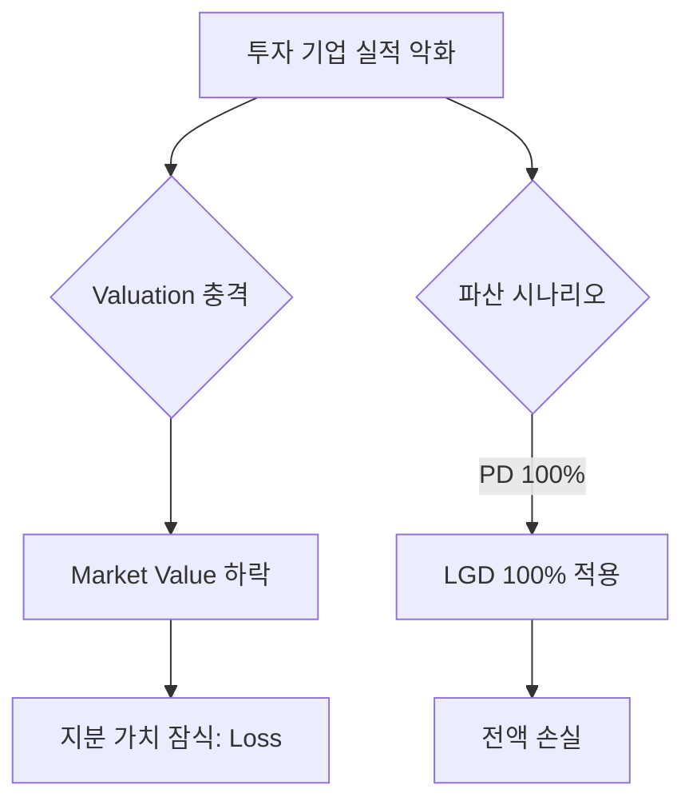

# 지분 투자 (Equity Investment) 기초

## 🔥 목적

지분 투자는 기업의 소유권(Stock)을 취득하여 배당 수익(Dividend)과 경영권 프리미엄 또는 시세 차익(Capital Gain)을 목적으로 하는 투자 기법입니다. 
IB 영역에서는 주로 비상장 주식, 전략적 지분 인수(M&A) 등을 다룹니다.

### ─────────────

## 📌 1. 지분의 성격: 후순위성 (Subordination)

지분은 리스크 체인의 최하단에 위치합니다. 
기업 자산에 대한 청구권 순위가 대출(Loan)이나 채권(Bond)보다 늦기 때문에 가장 높은 리스크를 부담하는 대신 높은 수익을 기대합니다.

### ─────────────

## 🧠 2. 리스크 변수와 가치 하락 (Shock)

지분 자산은 신용 리스크 모델인 PD/LGD 프레임워크를 차용하면서도, 본질적으로는 **'가격 변동 리스크'**로 관리됩니다.

### 리스크 연산 메커니즘

### ─────────────

## 📊 3. 비상장 주식 가치 평가 (Valuation)

상장 주식과 달리 비상장 주식은 공정 가치 측정이 어렵습니다.

- **DCF (현금흐름 할인법)**: 미래 예상 현금흐름을 현재 가치로 할인.
- **Relatvie Value (상대 가치)**: 유사 상장 기업의 PER, EV/EBITDA 배수를 적용.
- **Cost Method (원가법)**: 취득 원가를 기준으로 평가 (초기 투자 단계).

### ─────────────

## 💰 4. 수익 실현 (Exit)

지분 투자의 성패는 최종 시점의 엑시트에 달려 있습니다.

- **IPO (기업 공개)**: 주식 시장 상장을 통한 구주 매출 및 시세 차익.
- **M&A (경영권 매각)**: 전략적 투자자(SI) 또는 재무적 투자자(FI)에게 매각.
- **Dividend (배당)**: 보유 기간 동안 발생하는 순이익 배분.

### ─────────────

## 🔗 연결

- [비상장 딜 라이프사이클 및 북킹 가이드](Unlisted_Deal_Lifecycle.md)
- [지분 매핑 가이드](./Equity_Mapping.md)
- [시장 가치 (Market Value)](../../../01_Core_Model/Market_Value.md)

### ─────────────

*최종 업데이트: 2026-04-14*
