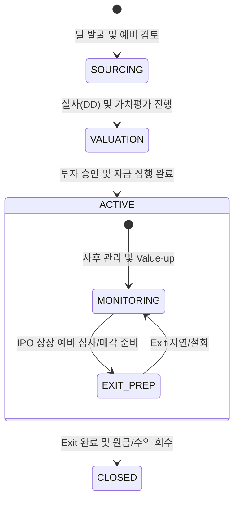

# 지분 투자 라이프사이클 및 이벤트 모델 명세

## 1. 개요 (Overview)
본 문서는 지분 투자(Equity) 딜의 생애주기를 상태 전이(State Transition)와 비즈니스 이벤트(Event) 관점에서 정의합니다. 투자 시점의 가치 산정과 사후 관리 단계의 Mark-to-Market 변동, 그리고 최종 Exit 경로에 따른 가치 실현을 추적하는 것이 핵심입니다.

---

## 2. State Machine (상태 전이 모델)

지분 투자 딜의 상태는 실사 강도와 Exit 준비 단계에 따라 다음과 같이 전이됩니다.

---

## 3. Event Catalog (비즈니스 이벤트 명세)

도메인 내에서 발생하는 핵심 이벤트와 그에 따른 구조적 영향입니다.

| Event Name | Trigger (발생 조건) | Impact Factor (영향) | Extension Layer 연동 |
| :--- | :--- | :--- | :--- |
| **VALUATION_FINALIZED** | 투심위 상정용 최종 가치 산정 완료 | **Value**: 투자 원본 및 목표 수익률 확정 | DCF/Multiples 모델 선택 |
| **FUNDING_COMPLETED** | 주권 인수 및 대금 지급 완료 | **Risk**: 자본 잠식 리스크 노출 시작 | 인수 금융(Private Debt) 연계 |
| **MTM_UPDATED** | 주기적 공정가치 평가(Mark-to-Market) | **Value**: 평가 이익/손실 장부 반영 | 가격 변동성(Shock) 반영 |
| **IPO_FILED** | 거래소 상장 예비 심사 청구 | **Value**: 유동성 프리미엄 반영 및 가치 상승 | Exit Strategy (IPO) 진입 |
| **EXIT_EXECUTED** | 지분 매각 및 자금 유입 완료 | **Value**: 최종 Cashflow 및 수익률 확정 | 시세 차익(Capital Gain) 정산 |

---

## 4. Phase별 구조 상세 (Core vs Extension)

### Phase 1. 딜 소싱 및 가치 평가 (Core)
- **핵심 행위**: 사업/재무 실사, 밸류에이션 모델링.
- **이벤트**: `VALUATION_FINALIZED`.
- **Extension**: 투자 초기 단계에서 인수 금융(Private Debt) 구조 설계 병행.

### Phase 2. 투자 집행 및 관리 (Core)
- **핵심 행위**: 주권 확보, 사후 가치 제고(Value-up).
- **이벤트**: `FUNDING_COMPLETED`, `MTM_UPDATED`.
- **Extension**: 거버넌스 개선 이벤트를 통한 Value-up 성과 추적.

### Phase 3. 엑시트 및 종료 (Core)
- **핵심 행위**: 상장(IPO) 또는 M&A 매각 추진.
- **이벤트**: `IPO_FILED`, `EXIT_EXECUTED`.
- **Extension**: IPO vs Trade Sale 경로별 수수료 및 세금 구조 최적화.

---

## 🔗 연결
- [지분 투자 도메인 기초 및 명세](./Basics.md)
- [지분 리스크 매핑 가이드](./Equity_Mapping.md)

### ─────────────

*최종 업데이트: 2026-04-16 (이벤트 기반 구조 반영)*
