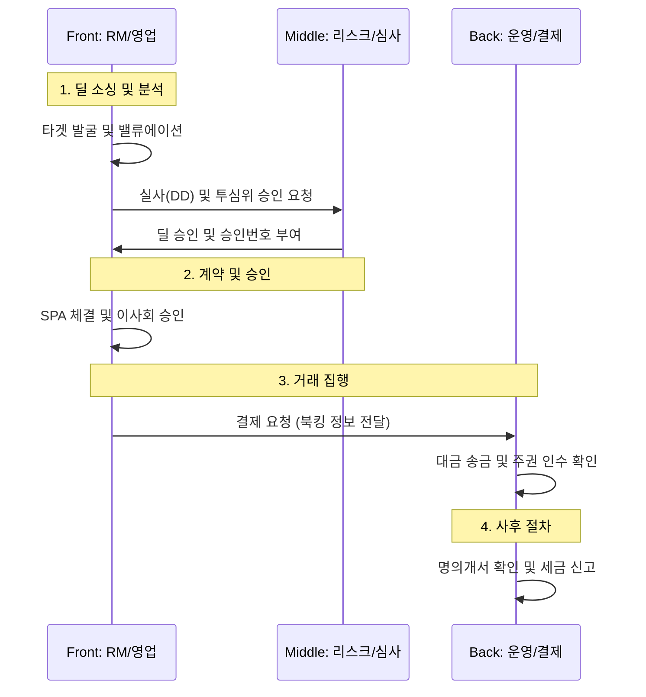

# 비상장 주식 딜 라이프사이클 (Unlisted Stock Deal Lifecycle)

본 문서는 비상장 주식 투자의 발굴(Sourcing)부터 북킹(Booking), 그리고 사후 관리(Post-closing)에 이르는 전체 운영 프로세스와 실무 가이드라인을 정의합니다.

## 1. 전 과정 업무 흐름도 (End-to-End Flow)

비상장 딜은 프론트, 미들, 백오피스의 긴밀한 협업을 통해 완성됩니다.

---

## 2. 단계별 상세 가이드

### Phase 1. 딜 소싱 및 분석 (Deal Sourcing & Valuation)
-   **투자 대상 발굴**: 스타트업, VC 투자사 네트워크를 통한 유망 비상장 기업 발굴.
-   **사전 평가**: 유사 기업 비교 등을 통한 기업가치(Valuation) 산정.
-   **실사 (Due Diligence)**: 
    -   **재무**: 현금흐름, 우발 채무 확인.
    -   **법률**: 경영권 구조, 소송 리스크, 정관 검토.
    -   **기술**: 핵심 기술의 독점성 및 시장성 검토.

### Phase 2. 계약 및 승인 (Agreement & Approval)
-   **주식 양수도 계약 (SPA)**: 양도인과 양수인 간 매매 조건 명시.
-   **내부 승인**: 이사회 승인 및 투자심의위원회(투심위) 최종 통과.

### Phase 3. 거래 집행 (Execution)
-   **매매 대금 지급**: 약정된 날짜에 대금 송금.
-   **주식 이전**: 
    -   **통일주권**: 예탁결제원을 통한 계좌 이체.
    -   **비통일주권**: 실물 주권 인수 또는 확정일자 있는 양도 통지.

### Phase 4. 사후 절차 (Post-closing)
-   **명의개서 (Title Transfer)**: 주주명부 상 양도인을 양수인으로 변경 (**실제 권리 확보에 필수**).
-   **세금 신고 및 납부**:
    -   **양도소득세**: 매도자 신고 (대주주 여부 등에 따라 10~30% 차등).
    -   **증권거래세**: **0.35%** (비상장 기준, 매도자 원천징수 또는 신고).

---

## 3. 실무 북킹 정보 표준 (Booking Information)

시스템 등록 및 관리를 위한 핵심 데이터 항목입니다.

| 분류 | 항목명 | 상세 내용 |
| :--- | :--- | :--- |
| **딜 기본 정보** | 딜 번호 / 유형 | 자동생성 ID, 유형(신주, 구주양수도, 블록딜) |
| | 담당 조직 | 관리 RM본부, 투심위 승인번호 |
| **종목 정보** | 발행사 정보 | 발행사명, 사업자번호 |
| | 주식 종류 | 보통주, **RCPS**, CPS 등 / 주권구분(통일/비통일) |
| **거래 조건** | 가격 정보 | 매매수량, 주당단가, 총액, 발행가 대비 할인/할증율 |
| | 상대방 정보 | 매도/매수자 명칭, 계좌번호, 전문투자자 여부 |
| **결제/수수료** | 결제 정보 | 결제 예정일, 입고 계좌 |
| | 비용 정보 | 주선수수료(Fee), VAT 여부, 증권거래세 징수 방식 |

---

## 4. 비상장 세무 가이드 (Tax Summary)

| 구분 | 세율 | 비고 |
| :--- | :---: | :--- |
| **증권거래세** | **0.35%** | 매도 시 발생 (비상장 주식 법정 세율) |
| **양도소득세** | 10% ~ 30% | 중소기업 여부, 대주주 여부, 보유 기간에 따라 차등 |

---
*참조: Equity Basics, Risk Management Policy*
