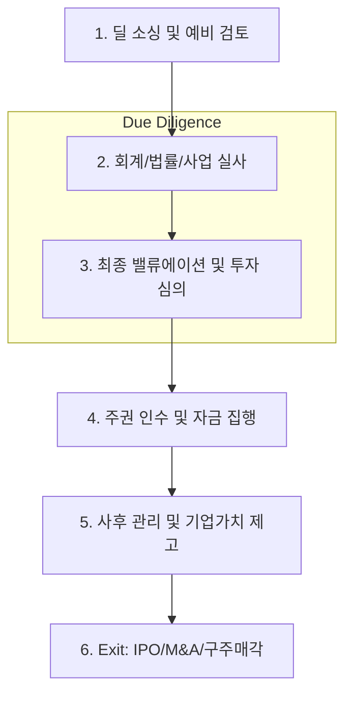

# 비상장 지분 딜 라이프사이클 및 북킹 가이드 (Unlisted Equity Lifecycle & Booking)

## 🔥 목적

비상장 지분 투자의 발굴, 심사, 투자 집행 및 사후 관리 시스템 북킹 표준을 정의합니다. 
지분 투자는 대출이나 채권과 달리 현금흐름이 불확실하므로, 투자 시점의 **Valuation**과 사후 **엑시트(Exit)** 관리가 핵심입니다.

### ─────────────

## 📌 1. 전 과정 업무 흐름도 (End-to-End Flow)

비상장 투자는 철저한 실사(DD)를 통한 가치 평가 단계와 지속적인 기업 가치 제고(Value-up) 단계로 나뉩니다.

### 업무 프로세스 시각화

### ─────────────

## ⚙️ 2. 단계별 상세 가이드

### Phase 1. 딜 소싱 및 검토 (Sourcing)
- **투자 매력도 분석**: 시장 성장성, 기술력, 경영진 역량 평가.
- **Teaser/IM 검토**: 대상 기업의 재무 상태 및 투자 조건(Round) 확인.

### Phase 2. 실사 단계 (Due Diligence)
- **회계 실사**: 과거 재무제표의 적정성 및 잠재 부채 확인.
- **법률 실사**: 정관, 주주 간 계약서(SHA), 인허가, 지식재산권 보호 여부 확인.
- **사업 실사 (CDD)**: 실제 시장 점유율 및 고객 평판 조사.

### Phase 3. 주주 간 계약 및 집행 (Investment)
- **주무 계약**: 동반매도권(Tag-along), 동반매각요청권(Drag-along) 등 보호 장치 명시.
- **투자 집행**: 신주 인수(Capital Increase) 또는 구주 매입.

### Phase 4. 사후 관리 (Post-Investment)
- **Value-up**: 재무 구조 개선, 네트워크 연결, 후속 투자 유치 지원.
- **대외 공시**: 투자 자산의 주기적 공정가치 평가(Mark-to-Market).

### Phase 5. 엑시트 (Exit)
- **IPO**: 증시 상장을 통한 이익 실현.
- **Trade Sale**: 타 기업으로의 경영권 매각.

### ─────────────

## 📂 3. 실무 북킹 정보 표준 (Booking Information)

### 가. 투자 대상 및 구조 정보
- **기업 정보**: 법인명, 산업군, 투자 라운드(Series A/B/C 등).
- **지분 정보**: 보유 주식 수, 지분율, 주당 취득가, 총 투자 원금.
- **증권 종류**: 보통주, 전환상환우선주(RCPS), 전환사채(CB).

### 나. 밸류에이션 및 회계 데이터
- **평가 정보**: 적용 밸류에이션 모델(DCF/Multiple), 적용 멀티플 배수.
- **비용 정보**: 주선수수료(Fee), VAT 여부, 증권거래세 징수 방식.

### ─────────────

## 💰 4. 비상장 세무 가이드 (Tax Summary)

비상장 주식 양도세는 대주주 여부와 중소기업 여부에 따라 세율이 복잡하게 적용됩니다 (2024~2025 기준).

### 양도 관련 세율표

| 구분 | 세율 | 비고 |
| :--- | :--- | :--- |
| **증권거래세** | **0.35%** | 매도 시 발생 (비상장 주식 법정 세율) |
| **양도소득세 (소액주주)** | **10% ~ 20%** | 중소기업 여부에 따라 차등 |
| **양도소득세 (대주주)** | **20% ~ 30%** | 보유 기간 및 과세표준 3억 초과 여부 반영 |

### IMPORTANT: 비상장 대주주 판정 요건
직전 사업연도 종료일 기준 **지분율 4% 이상** 또는 **시가총액 50억 원 이상** 충족 시 대주주로 분류되어 높은 세율이 적용되므로 주의가 필요합니다.

### ─────────────

## 🔗 연결

- [지분 투자 기초 (Equity Basics)](Basics.md)
- [지분 매핑 가이드](./Equity_Mapping.md)

### ─────────────

*최종 업데이트: 2026-04-14*
