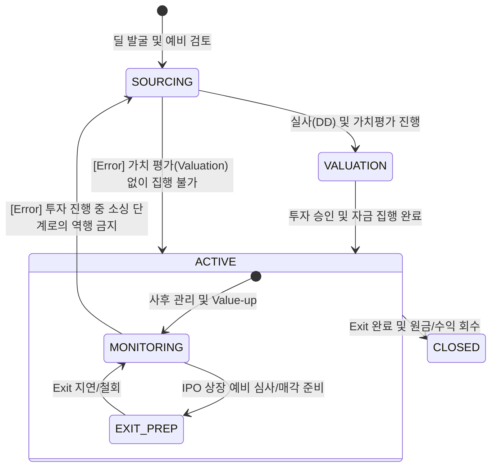

# 지분 투자 라이프사이클 및 이벤트 모델 명세

## 1. 개요 (Overview)
본 문서는 지분 투자(Equity) 딜의 생애주기를 상태 전이(State Transition)와 비즈니스 이벤트(Event) 관점에서 정의합니다. 투자 시점의 가치 산정부터 최종 엑시트까지의 과정을 추적하며, 특히 **이벤트 정합성 검증(Validation Layer)**을 통해 자본 잠식 및 가치 평가의 논리적 오류를 방지합니다.

---

## 2. State Machine (상태 전이 모델)

지분 투자 딜의 상태는 실사 강도와 Exit 준비 단계에 따라 다음과 같이 전이됩니다.

---

## 3. Full Event Catalog & Validation Layer

모든 이벤트는 정합성 검증 규칙을 준수해야 합니다.

| Event Name | Pre-condition (필수 상태/데이터) | Trigger Condition | Post-state | Invalid Transition |
| :--- | :--- | :--- | :--- | :--- |
| **VALUATION_FINALIZED** | `SOURCING` / `DD_Report` | 투심위 상정용 최종 가치 산정 완료 | `VALUATION` | `ACTIVE`에서 역발생 금지 |
| **FUNDING_COMPLETED** | `VALUATION` / `Share_Agreement` | 주권 인수 및 대금 지급 완료 | `ACTIVE:MONITORING` | `SOURCING` 상태에서 직접 발생 |
| **MTM_SHOCK_EVENT** | `MONITORING` / `Market_Index` | 시장 가치 급락 또는 실적 악화 | `MONITORING` (Impaired) | `SOURCING`, `VALUATION` 상태 |
| **IPO_FILED** | `MONITORING` / `Exchange_Receipt` | 자본시장 상장 예비 심사 청구 | `EXIT_PREP` | `SOURCING` 상태에서 발생 |
| **EXIT_SUCCESS** | `EXIT_PREP` / `Closing_Report` | 지분 매각 대금 유입 완료 | `CLOSED` | `VALUATION` 상태에서 직접 전이 |
| **INVESTMENT_WRITE_OFF**| `MONITORING` or `EXIT_PREP` | 기업 파산 또는 가치 전액 잠식 | `CLOSED` (Loss) | `SOURCING` 상태에서 발생 |

---

## 4. 리스크 전이 논리 (Event Logic)

### 가. 정합성 검증 규칙 (Validation Rules)
1. **후순위성 원칙 (Subordination)**: `INVESTMENT_WRITE_OFF` 이벤트는 해당 기업의 부도 시 전 순위 채권(Senior/Mezzanine)의 전액 상실이 확인된 후에만 최종 확정될 수 있음.
2. **평가 가역성**: `MTM_SHOCK_EVENT`는 `MONITORING` 상태 내에서 가변적이며, `EXIT_SUCCESS` 전까지는 확정 손실로 간주되지 않음(평가 손익).
3. **Exit 경로 확정**: `EXIT_SUCCESS` 이벤트는 반드시 `EXIT_PREP` 상태의 선행 데이터(매각 주관사 계약, 상장 청구 등)가 존재해야 트리거 가능.

---

## 🔗 연결
- [지분 투자 도메인 기초 및 명세](./Basics.md)
- [지분 리스크 매핑 가이드](./Equity_Mapping.md)

### ─────────────

*최종 업데이트: 2026-04-16 (논리적 정합성 규칙 강화)*
