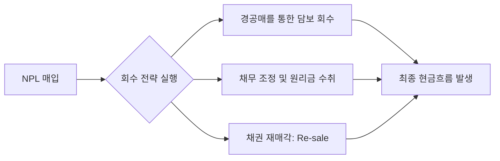

# 부실채권 (Non-Performing Loan, NPL) 기초

## 🔥 목적

NPL은 금융기관의 대출금 중 원리금 상환이 3개월 이상 연체된 '고정이하' 등급의 채권을 의미합니다. 
IB 영역에서는 이러한 부실채권을 저가에 매입하여 담보 처분 등을 통해 회수 이익을 극대화하는 투자 기법으로 다뤄집니다.

### ─────────────

## 📌 1. NPL의 수익원 및 회수 구조

NPL 투자의 핵심은 **'매입가와 회수가의 차이'**입니다.

### 현금흐름 발생 경로

### ─────────────

## ⚙️ 2. 리스크 전이 모델

NPL은 이미 부도가 발생(PD=100%)한 자산이므로, 리스크의 성격이 일반 자산과 상이합니다.

### 리스크 변수 해석
- **부도 확률 (PD)**: **100% (고정)**
- **부도 시 손실률 (LGD)**: 담보 가치 변동 및 경매 유찰 횟수에 정비례.
- **부도 시 노출액 (EAD)**: 투자 원금 및 회수 비용의 총합.

### ─────────────

## 📊 3. 실무적 핵심 지표: OPB vs 매입가

NPL 관리 시 가장 중요한 데이터는 장부상 원금과 실제 매입 가격의 차이입니다.

- **OPB (Outstanding Principal Balance)**: 미상환 원금 잔액 (채권의 액면가)
- **매입가 (Purchase Price)**: 시장 가치와 회수 가능성을 고려한 실제 취득가

👉 **수익률(Yield)**은 OPB가 아닌 **매입가**를 기준으로 산출됩니다.

### ─────────────

## 🔗 연결

- [NPL 딜 라이프사이클 및 북킹 가이드](NPL_Deal_Lifecycle.md)
- [NPL 리스크 매핑](./NPL_Mapping.md)
- [통합 리스크 프레임워크](../../02_Integrated_IB/01_Unified_Risk_Framework.md)

### ─────────────

*최종 업데이트: 2026-04-14*
