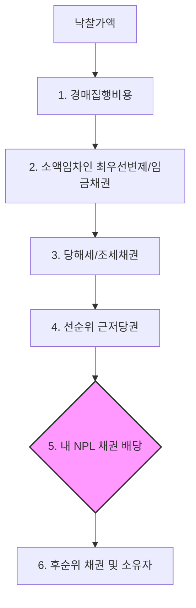

# 부실채권 (Non-Performing Loan, NPL) 기초

부실채권(NPL)은 금융기관이 대출해준 원금이나 이자를 제때 회수하지 못하여 '고정이하'로 분류된 채권입니다. 투자자는 이를 할인된 가격에 매입하여 회수(경매, 채무재조정 등)를 통해 수익을 창출합니다.

## 1. NPL 가치평가 방법론

NPL의 적정 매입가를 산정하기 위해 실무적으로는 다음 두 가지 방법론을 혼용합니다.

| 방법론 | 핵심 논리 | 주요 적용 대상 |
| :--- | :--- | :--- |
| **청산가치법 (Liquidation)** | 담보물의 **경매 처분** 시 예상 배당액 기준 | 일반 담보부 채권 (주력 방법론) |
| **현금흐름할인법 (DCF)** | 채무자의 **정상화 및 상환 능력** 기준 | 기업회생, 채무재조정 채권 |

## 2. 실무의 핵심: '배당판' 산출 로직

담보부 NPL 투자의 성패는 경매 낙찰금액에서 내가 실제 배당받을 수 있는 금액인 **'청산가치'**를 얼마나 정확히 예측하느냐에 달려 있습니다.

### 배당 우선순위와 공제 흐름
현금은 아래 순서에 따라 차례대로 차감되며, NPL 채권자는 자기 순서가 올 때까지 기다려야 합니다.

### NPL 딜 라이프사이클 및 회수 전략
NPL의 물건 발굴부터 상계처리(Off-set) 기법, 그리고 전략적 회수 의사결정 가이드는 **[NPL 딜 라이프사이클 및 회수 가이드](NPL_Deal_Lifecycle.md)**에서 상세히 다룹니다.

### 필수 공제 항목 체크리스트
1.  **경매 비용**: 감정비, 송달료 등 (낙찰가의 약 1~2%).
2.  **임금 채권**: 최종 3개월분 임금 및 3년분 퇴직금.
3.  **당해세**: 해당 부동산에 직접 부과된 재산세, 종부세 등.
4.  **우선변제금**: 지역별 법정 기준에 따른 소액 임차인 보호 금액.

## 3. 수치 예시: 배당 시뮬레이션

*   **담보물**: 감정가 10억 원 상가 (예상 낙찰가율 80% 가정 -> **8억 원**)
*   **NPL 채권**: 원금 6억, 연체이자 포함 채권최고액 **7.2억** (매입가 5억 가정)

| 항목 | 금액 | 누적 차감액 | 잔액 (배당 가능액) |
| :--- | :---: | :---: | :---: |
| **예상 낙찰가** | **80,000만** | - | 80,000만 |
| 1. 경매 비용 | 1,000만 | 1,000만 | 79,000만 |
| 2. 선순위 당해세 | 2,000만 | 3,000만 | 77,000만 |
| 3. 선순위 임금채권 | 5,000만 | 8,000만 | 72,000만 |
| **4. NPL 채권 배당** | **72,000만** | **80,000만** | **0 (Full Pay)** |

> **분석**: 매입가 5억 대비 7.2억을 배당받으므로 **2.2억(44%)의 수익** 발생. (단, 낙찰가가 7억으로 떨어지면 수익은 급감함)

## 4. 수익 극대화를 위한 전문 회수 전략

위의 단순 배당 외에도 IB 실무에서는 다음과 같은 전략적인 회수 방식을 취합니다.

-   **방어입찰 (Defensive Bidding)**: 경매 시장이 냉각되어 낙찰가가 너무 낮아질 것 같으면, 채권자가 직접 높은 금액에 입찰하여 배당금을 확보하거나 직접 소유권을 방어하는 전략.
-   **직접 유입 (Direct Acquisition)**: 채권자가 직접 낙찰을 받아 소유권을 취득(**`유입`** - 현업)한 후, 자산 가치를 제고(Value-add)하여 비싸게 매각하는 전략.
-   **론세일 (Loan Sale)**: 보유한 NPL 채권을 다른 투자자에게 다시 매각하여 조기에 이익을 확정하는 방식.

## 5. 통합 리스크 프로필 (Unified Risk Profile)
NPL은 이미 부실화된 자산이므로 **PD보다 LGD(회수 실패율) 관리가 핵심**입니다.

-   **부도 확률 (PD)**: **100% 고정** (이미 부실화됨).
-   **부도 시 손실률 (LGD)**: **[1 - (예상 배당액 / 채권 매입가)]**. 담보 가치 하락이나 선순위 채권 과다 시 증가.
-   **부도 시 노출액 (EAD)**: 보유 **채권 잔액** 또는 **NPL 매입 원금**.

## 6. 관련 문서 (Related Documents)
- **통합 리스크 프레임워크**: [01_Unified_Risk_Framework.md](../../02_Integrated_IB/01_Unified_Risk_Framework.md) - PD/LGD/EAD 매핑 이론.
- **통합 시너지 맵**: [Synthesis_Map.md](../../02_Integrated_IB/Synthesis_Map.md) - 자산 간 연계 구조(PF->NPL 전이).
- **리스크 관리 정책**: [Risk_Management_Policy.md](../../01_Foundations/Risk_Management_Policy.md) - 전사적 리스크 거버넌스.

---
*최종 수정일: 2026-04-11*
