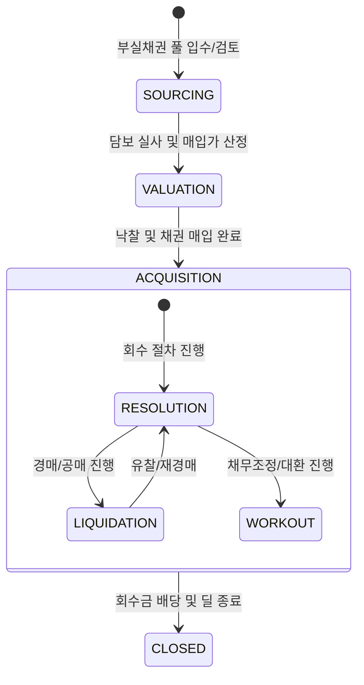

# NPL 라이프사이클 및 이벤트 모델 명세

## 1. 개요 (Overview)
본 문서는 NPL(부실채권) 딜의 생애주기를 상태 전이(State Transition)와 비즈니스 이벤트(Event) 관점에서 정의합니다. 이미 부도난 자산의 회수 경로를 추적하고, 시점별 회수 가치 변동을 모니터링하는 것이 핵심입니다.

---

## 2. State Machine (상태 전이 모델)

NPL 딜의 상태는 매입 후 회수 전략 실행 단계에 따라 다음과 같이 전이됩니다.

---

## 3. Event Catalog (비즈니스 이벤트 명세)

도메인 내에서 발생하는 핵심 이벤트와 그에 따른 구조적 영향입니다.

| Event Name | Trigger (발생 조건) | Impact Factor (영향) | Extension Layer 연동 |
| :--- | :--- | :--- | :--- |
| **PORTFOLIO_ACQUIRED** | 채권 양수도 계약 및 대금지급 완료 | **Value**: 투자 원금(EAD) 및 기초 OPB 확정 | AMC 위탁 계약 연동 |
| **ASSET_VALUED** | 현장 실사 및 감정평가 완료 | **Risk**: 회수 예상가 기반 LGD 재산정 | Valuation 모델 주입 |
| **AUCTION_SUCCESSFUL** | 경매 낙찰 및 배당금 확정 | **Value**: 최종 회수 현금흐름 정산 | Resolution Path 종료 |
| **WORKOUT_AGREED** | 채무자와의 감면/분할상환 합의 | **Risk**: PD 재설계 및 회수 확실성 증대 | Workout 분기 진입 |
| **COLLECTION_COMPLETED**| 잔여 채권 정리 및 법인 해산 | **Value**: 최종 이익/손실 확정 | Exit 가치 정산 |

---

## 4. Phase별 구조 상세 (Core vs Extension)

### Phase 1. 매입 및 평가 (Core)
- **핵심 행위**: 담보 실사, 매입 밸류에이션.
- **이벤트**: `PORTFOLIO_ACQUIRED`, `ASSET_VALUED`.
- **Extension**: AMC 전담 관리자 배정 및 수수료 구조 확정.

### Phase 2. 회수 관리 (Core)
- **핵심 행위**: 경매 신청, 채무 협상.
- **이벤트**: `AUCTION_SUCCESSFUL`, `WORKOUT_AGREED`.
- **Extension**: Liquidation vs Workout 경로 선택에 따른 현금흐름 시뮬레이션.

### Phase 3. 종료 및 정산 (Core)
- **핵심 행위**: 배당금 정산, 채권 소멸 처리.
- **이벤트**: `COLLECTION_COMPLETED`.

---

## 🔗 연결
- [NPL 도메인 기초 및 명세](./Basics.md)
- [NPL 리스크 매핑 가이드](./NPL_Mapping.md)

### ─────────────

*최종 업데이트: 2026-04-16 (이벤트 기반 구조 반영)*
