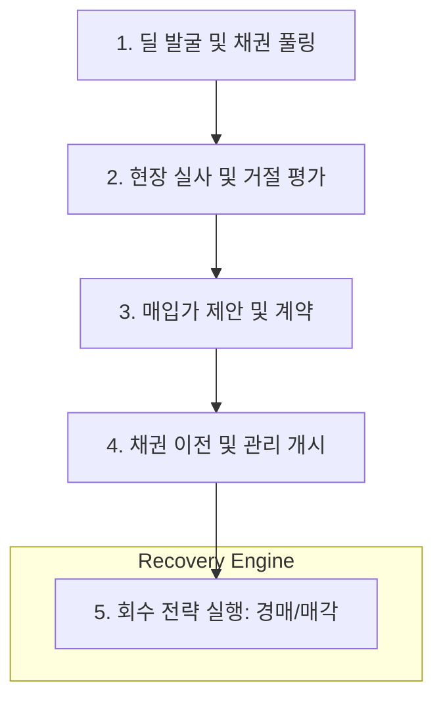

# NPL 딜 라이프사이클 및 북킹 가이드 (NPL Deal Lifecycle & Booking)

## 🔥 목적

부실채권(NPL)의 매입부터 가공, 회수 및 시스템 북킹 표준을 정의합니다. 
NPL은 자산의 매입 시점 대비 회수 시점의 현금흐름 극대화가 핵심입니다.

### ─────────────

## 📌 1. 전 과정 업무 흐름도 (End-to-End Flow)

NPL 투자는 채널별 매입 단계와 법적 절차 중심의 회수 단계로 나뉩니다.

### 업무 프로세스 시각화

### ─────────────

## ⚙️ 2. 단계별 상세 가이드

### Phase 1. 딜 발굴 (Sourcing)
- **채권 Pool 입수**: 금융기관으로부터 매각 예정 NPL 리스트 입수.
- **기초 분석**: OPB(원금), 담보 위치, 권리 순위 기초 필터링.

### Phase 2. 실사 및 평가 (Due Diligence & Valuation)
- **현장 실사**: 부동산 담보의 실제 가치, 점유 상태, 유치권 여부 등 물리적 실사.
- **예상 회수가액 산출**: 지역별 낙찰가율, 경매 소요 기간 시뮬레이션.

### Phase 3. 매입 및 북킹 (Booking)
- **낙찰 및 계약**: 경쟁 입찰을 통한 최종 매입가 확정.
- **시스템 등록**: 매입가, OPB, 연체이자율 등 기초 데이터 북킹.

### Phase 4. 회수 관리 (Servicing)
- **경매 진행**: 대환 유도, 담보권 실행(경매 신청).
- **채무 조정**: 채무자와의 협상을 통해 일시 상환 또는 채무 감면 계약 체결.

### Phase 5. 회수 완료 및 종료 (Exit)
- **배당금 수취**: 경매 낙찰금에서 배당금 수령.
- **환입**: 매입가 대비 초과 회수금 발생 시 수익 확정.

### ─────────────

## 📂 3. 실무 북킹 정보 표준 (Booking Information)

### 가. 기초자산 정보 (Underlying Asset)
- **채권 기본**: 채권번호, 원 채무자, 개시원금(OPB), 매이입일/만기일.
- **담보 상세**: 부동산 주소, 감정평가액, 선순위 채권액, 예상 낙찰가.

### 나. 투자 및 비용 데이터
- **투자 내역**: 실제 매입가(Purchase Price), 취득세, 법무 비용, 명도 비용.
- **회수 관리**: 자산관리자(Servicer) 정보, 관리 수수료율.

### ─────────────

## 🔗 연결

- [부실채권 기초 (NPL Basics)](Basics.md)
- [NPL 리스크 매핑](../../02_Integrated_IB/02_Asset_Mapping/NPL_Mapping.md)

### ─────────────

*최종 업데이트: 2026-04-14*
