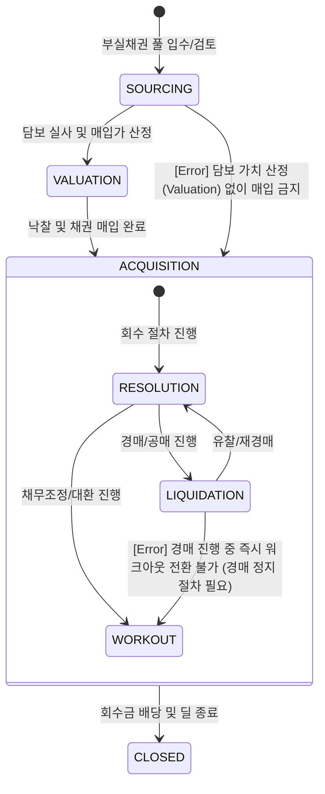

# NPL 라이프사이클 및 이벤트 모델 명세

## 1. 개요 (Overview)
본 문서는 NPL(부실채권) 딜의 생애주기를 상태 전이(State Transition)와 비즈니스 이벤트(Event) 관점에서 정의합니다. 이미 부도난 자산의 회수 경로를 추적하며, **이벤트 정합성 검증(Validation Layer)**을 통해 회수 시점의 논리적 결함을 원천 차단합니다.

---

## 2. State Machine (상태 전이 모델)

NPL 딜의 상태는 매입 후 회수 전략 실행 단계에 따라 다음과 같이 전이됩니다.

---

## 3. Full Event Catalog & Validation Layer

모든 이벤트는 정합성 검증 규칙을 준수해야 합니다.

| Event Name | Pre-condition (필수 상태/데이터) | Trigger Condition | Post-state | Invalid Transition |
| :--- | :--- | :--- | :--- | :--- |
| **PORTFOLIO_ACQUIRED** | `VALUATION` / `Final_Bid_Price` | 채권 양수도 계약 및 대금지급 완료 | `ACQUISITION` | `SOURCING`에서 직접 전이 |
| **ASSET_VALUED** | `SOURCING` / `Site_Visit_Log` | 현장 실사 및 감정평가 완료 | `VALUATION` | `CLOSED` 상태에서 발생 |
| **AUCTION_SUCCESSFUL** | `LIQUIDATION` / `Court_Order` | 경매 낙찰 및 배당금 확정 | `CLOSED` (Recovered) | `WORKOUT` 상태에서 직접 발생 |
| **WORKOUT_AGREED** | `RESOLUTION` / `Agreement_Doc` | 채무자와의 감면/분할상환 합의 | `WORKOUT` | `LIQUIDATION` 상태에서 직접 발생 |
| **AUCTION_FAILED** | `LIQUIDATION` / `No_Bidder` | 최저 매각가 미달로 유찰 | `RESOLUTION` (Re-bid) | `CLOSED` 상태에서 발생 |
| **COLLECTION_FINAL** | `Recovered` or `WORKOUT` | 잔여 채권 정리 및 법인 해산 | `CLOSED` | `SOURCING`, `VALUATION` 상태 |

---

## 4. 리스크 전이 논리 (Event Logic)

### 가. 정합성 검증 규칙 (Validation Rules)
1. **경로 상호 배타성**: `ACQUISITION` 이후 회수는 반드시 `LIQUIDATION` 또는 `WORKOUT` 중 하나의 경로를 거쳐야 하며, 인가되지 않은 경로로의 이탈을 금지함.
2. **PD 고정 원칙**: NPL 도메인 내의 모든 이벤트는 `PD=100%`임을 전제로 하며, 어떤 이벤트도 `PD`를 100% 미만으로 변경할 수 없음.
3. **가치 하한선(Floor)**: `AUCTION_FAILED` 반복 시 LGD는 증가하지만, `Final_Bid_Price` 미만으로의 회수 시도는 `WORKOUT` 전환 검토 대상이 됨.

---

## 🔗 연결
- [NPL 도메인 기초 및 명세](./Basics.md)
- [NPL 리스크 매핑 가이드](./NPL_Mapping.md)

### ─────────────

*최종 업데이트: 2026-04-16 (논리적 정합성 규칙 강화)*
