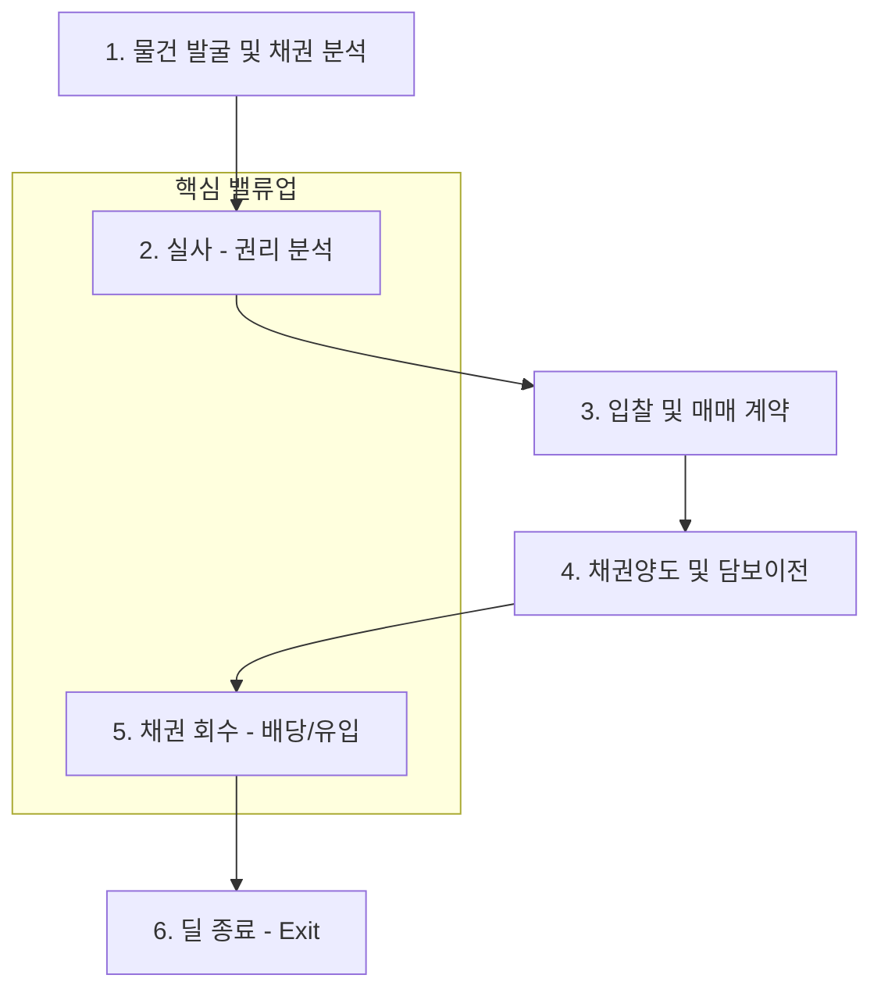

# NPL 딜 라이프사이클 및 회수 가이드 (NPL Deal Lifecycle & Recovery)

본 문서는 부실채권(NPL)의 물건 발굴부터 권리 분석, 입찰 및 자산 회수(Recovery)에 이르는 실무 프로세스와 북킹 표준을 정의합니다.

## 1. 전 과정 업무 흐름도 (End-to-End Flow)

NPL 투자는 채권을 할인된 가격에 매입하여 회수 가치를 극대화하는 과정입니다.

---

## 2. 단계별 상세 가이드

### Phase 1. 물건 발굴 및 채권 분석 (Sourcing & Analysis)
-   **대상 자산 확보**: 금융기관(은행, AMC 등)의 매각 예정 NPL 풀 확보.
-   **수익성 분석**: 담보 부동산 가치, 선순위 채권액, 예상 낙찰가(경낙률) 분석을 통한 기대 수익률 계산.

### Phase 2. 실사 (Due Diligence)
-   **법적 위험 분석**: 저당권, 채무자 서류 검토 및 권리관계 정밀 확인.
-   **특수 권리 체크**: **유치권, 법정지상권** 등 경매 시 회수금을 깎아먹는 특수 요인 식별.

### Phase 3. 입찰 및 매매 계약 (Bidding & Closing)
-   **인수가 산정**: 실사 결과를 바탕으로 입찰 참여 및 채권매매계약(SPA) 체결.
-   **잔금 납입**: 유동화 회사 등에 대출 채권 양도 대금 완납.

### Phase 4. 채권양도 및 담보이전 (Assignment & Registration)
-   **권리 주체 변경**: 원채권자(은행)에서 투자자로 채권자 지위 변경통지.
-   **담보권 확보**: **저당권 이전 등기**(질권 설정 포함)를 통해 대항력 확보.

### Phase 5. 채권 회수 (Resolution & Recovery)
NPL 수익 실현의 핵심 단계입니다.

-   **배당 투자**: 경매 절차에서 배당을 받아 원리금과 연체이자를 회수.
-   **경매 유입 (Ingression)**: 투자자가 직접 담보물을 낙찰받아 소유권 취득.
-   **상계처리 (**`Off-set`**)**: 유입 시 본인이 배당받을 금액을 제하고 차액만 법원에 납부.

> **[상계처리 수치 예시]**
> - **낙찰가**: 10억 원
> - **투자자의 채권액 (배당 예상액)**: 8억 원
> - **실제 현금 납부액**: **2억 원** (10억 - 8억) -> 자금 효율성 극대화

### Phase 6. 딜 종료 (Exit)
-   담보물 최종 매각, 배당금 수령, 채무자와의 협상 종료 후 투자 원금 및 수익 확정.

---

## 3. 전략적 회수 의사결정 (Strategic Choice)

| 상황 (Context) | 추천 전략 | 핵심 장점 |
| :--- | :--- | :--- |
| **담보물의 미래 가치가 높을 때** | **경매 유입 (Ingression)** | 자산 가치 제고(Value-add) 후 매각 수익 극대화 |
| **빠른 현금 회수가 필요할 때** | **론세일 (Loan Sale)** | 즉시 현금화 및 유동성 확보 |
| **채무자의 상환 의지가 있을 때** | **채무조정 (DPO)** | 경매 비용 및 시간 절감, 비용 효율적 회수 |

---

## 4. 실무 북킹 정보 표준 (Booking Information)

시스템 등록 시 기초 자산의 건전성과 가격 구조를 명확히 관리해야 합니다.

| 분류 | 항목명 | 상세 내용 |
| :--- | :--- | :--- |
| **채권 가액** | **OP / OPB** | 차입자의 원래 원금(Original) / 매입 시점 잔액(Outstanding) |
| **매입 조건** | 매입가 / 할인율 | 실제 취득 가격 / OPB 대비 매입가 비율 (예: 70%) |
| | 채권 등급 | 고정, 회수불량, 추정손실 등 건전성 분류 |
| **회수 지표** | 회수 방식 | 경매(Foreclosure), 채무조정(DPO), 채권 재매각(Sub-participation) |
| | 예상 회수금액 | 담보물 감정가와 경낙률을 고려한 **Expected Recovery** |

---
*참조: NPL Basics, ABS Deal Lifecycle*
