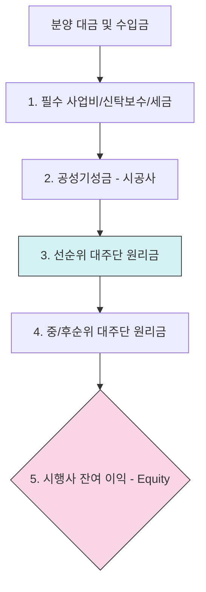

# 프로젝트 파이낸싱 (Project Financing, PF) 기초

프로젝트 파이낸싱(PF)은 시행사의 신용이 아닌, 특정 **프로젝트의 미래 수익성(분양 수익 등)**을 담보로 자금을 조달하는 금융 기법입니다. 부동산 개발 사업에서 가장 널리 사용됩니다.

## 1. 신(新) 사업성 평가 체계 (2024-2025 규제)

금융당국은 PF 시장의 건전성 제고를 위해 사업성 평가 등급을 4단계로 세분화하여 상시 모니터링하고 있습니다.

| 평가 등급 | 주요 판정 기준 (2024 핵심) | 사후관리 조치 |
| :--- | :--- | :--- |
| **양호 (Good)** | 연체 없고 사업 계획대로 정상 진행 | 정상 지원 / 만기 연장 |
| **보통 (Normal)** | 사업 추진 지연이나 분양 저조하나 회수 가능 | 자율적 재구조화 유도 |
| **유의 (Caution)** | **만기 연장 3회 이상** 또는 경/공매 유찰 2회 | **재구조화 및 자율매각** 추진 |
| **부실우려 (Risk)** | **만기 연장 4회 이상** 또는 경/공매 유찰 3회 이상 | **경/공매**를 통한 조기 정리 |

## 2. PF 수익 배분 워터폴 (Cashflow Waterfall)

분양 대금이 유입되면 아래의 우선순위에 따라 자금이 정산됩니다. 대주단(Lender)은 시행사(Developer)의 이익 배분보다 항상 우선합니다.

## 3. 리스크의 핵심: 책임준공 (Responsibility for Completion)

시공사가 공사 기간 내에 건물을 다 짓지 못할 경우, 신탁사나 시공사가 대주단에 대해 책임을 지는 구조입니다.

-   **책임준공 확약 (2025 모범규준)**: 시공사 부도 시 신탁사가 공사 완료 의무를 지게 되며, 최근 판례는 이를 단순 협조가 아닌 **'결과 채무'**로 보아 손해배상 책임을 강화하고 있습니다.
-   **리스크 전이**: 시공사(건설사)의 유동성 위기는 즉시 PF 사업장의 **PD(부도 확률)** 상승으로 직결됩니다.

### PF 딜 라이프사이클 및 북킹
브릿지론부터 본PF 전환, 그리고 상세 수수료(Fee) 구조 및 북킹 필드 가이드는 **[부동산 PF 딜 라이프사이클 및 북킹 가이드](PF_Deal_Lifecycle.md)**에서 상세히 다룹니다.

## 4. 사업성 민감도 분석 (Sensitivity Analysis)

공사비 상승 및 금리 인상이 분양가에 미치는 영향 예시입니다.

*   **가정**: 총 사업비 1,000억 원 (공사비 500억 포함), 목표 수익률 20%

| 시나리오 | 공사비 변동 | 조달 금리 | BEP(손익분기) 분양가 | 리스크 판정 |
| :--- | :---: | :---: | :---: | :--- |
| **Base Case** | 0% | 5% | 평당 2,500만 | 양호 |
| **Cost Push** | **+20%** | 5% | 평당 2,800만 | 보통 (분양성 하락) |
| **Worst Case** | **+20%** | **8%** | **평당 3,100만** | **유의 (사업성 결여)** |

## 5. 금융시장 연결: PF 유동화 (ABCP/ABSTB)

PF 대출 채권은 자본시장에서 증권화되어 거래됩니다.
-   **구조**: PF 대출채권을 SPC에 양도하고, 이를 담보로 기업어음(ABCP) 등을 발행.
-   **상세 구조 참조**: [자산유동화(ABS) 기초](../ABS/Basics.md) 문서의 워터폴 구조와 동일한 논리가 적용됨.
-   **현업 이슈**: 증권사의 **매입 확약**으로 인해 리스크가 금융권 전체로 전이되는 통로가 됨.

## 6. 통합 리스크 프로필 (Unified Risk Profile)
PF 리스크는 **'분양률'**과 **'준공 여부'**라는 두 개의 축으로 관리됩니다.

-   **부도 확률 (PD)**: LTV, 분양성 평가 점수, 시공사 신용등급을 결합하여 산출.
-   **부도 시 손실률 (LGD)**: 담보 가치(LTV) 및 신탁사의 신용보강(책임준공) 수준에 따라 결정.
-   **부도 시 노출액 (EAD)**: 대출 실행 잔액 및 미인출 한도(Commitment).

## 7. 관련 문서 (Related Documents)
- **통합 리스크 프레임워크**: [01_Unified_Risk_Framework.md](../../02_Integrated_IB/01_Unified_Risk_Framework.md) - 자산별 PD/LGD 매핑.
- **자산유동화 기초**: [ABS Basics](../ABS/Basics.md) - 유동화 및 워터폴 구조 상세.
- **리스크 전파 매커니즘**: [03_Risk_Propagation_Mechanics.md](../../02_Integrated_IB/03_Risk_Propagation_Mechanics.md) - 시공사 부실의 PF 전이 모델.

---
*최종 수정일: 2026-04-11*
