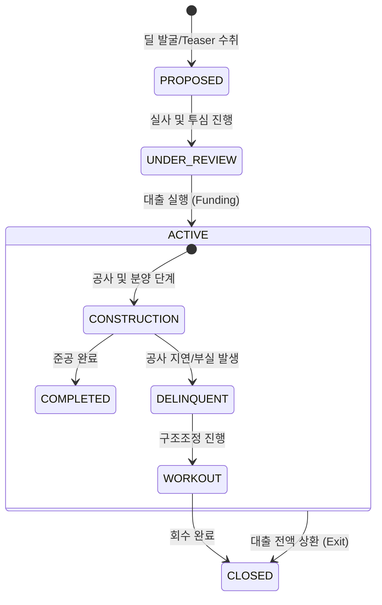

# PF 라이프사이클 및 이벤트 모델 명세

## 1. 개요 (Overview)
본 문서는 PF(프로젝트 파이낸싱) 딜의 생애주기를 상태 전이(State Transition)와 비즈니스 이벤트(Event) 관점에서 정의합니다. 모든 프로세스는 리스크 지표(PD/LGD)와 현금흐름에 미치는 영향도를 중심으로 설계되었습니다.

---

## 2. State Machine (상태 전이 모델)

PF 딜의 상태는 인허가 및 자금 조달 단계에 따라 다음과 같이 전이됩니다.

---

## 3. Event Catalog (비즈니스 이벤트 명세)

도메인 내에서 발생하는 핵심 이벤트와 그에 따른 구조적 영향입니다.

| Event Name | Trigger (발생 조건) | Impact Factor (영향) | Extension Layer 연동 |
| :--- | :--- | :--- | :--- |
| **MANDATE_RECEIVED** | 주관사 선정 및 업무 확약 | **Value**: Fee 수익 기회 발생 | MLA/MLM 구조 정의 |
| **LOAN_APPROVED** | 투자심의위원회 승인 완료 | **Risk**: 자금 조달 리스크 해소 | LOM(확약서) 발행 |
| **FUNDING_EXECUTED** | 대출 실행 및 자금 인출 | **Risk**: EAD 노출 시작 | Syndication 참여 현황 |
| **PRE_SALE_SHORTFALL**| 목표 분양률 미달 발생 | **Risk**: PD 급격히 상승 | 리스크 가중치 조정 |
| **ESG_CERTIFIED** | 친환경 인증 획득 완료 | **Value**: Spread 감면(Benefit) | ESG Factor 주입 |
| **EXIT_COMPLETED** | 준공 후 정산 및 환입 | **Value**: 원리금 및 이익 실현 | Exit Strategy 완료 |

---

## 4. Phase별 구조 상세 (Core vs Extension)

### Phase 1. 소싱 및 검토 (Core)
- **핵심 행위**: 사업지 분석, 시공사 신용도 확인.
- **이벤트**: `MANDATE_RECEIVED`.
- **Extension**: Syndication 구조(MLA) 확립.

### Phase 2. 집행 및 공사 (Core)
- **핵심 행위**: 기성고 대출 집행, 공정률/분양률 모니터링.
- **이벤트**: `FUNDING_EXECUTED`, `PRE_SALE_SHORTFALL`.
- **Extension**: ESG Factor에 따른 금리 조정 이벤트 체크.

### Phase 3. 회수 및 종료 (Core)
- **핵심 행위**: 분양대금 Waterfall 관리, 대출 상환.
- **이벤트**: `EXIT_COMPLETED`.

---

## 🔗 연결
- [PF 도메인 기초 및 명세](./Basics.md)
- [PF 리스크 매핑 가이드](./PF_Mapping.md)

### ─────────────

*최종 업데이트: 2026-04-16 (이벤트 기반 구조 반영)*
