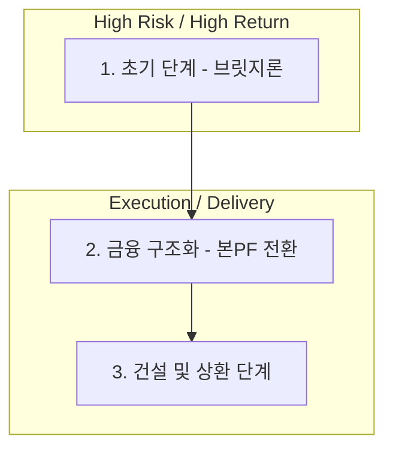

# 부동산 PF 딜 라이프사이클 및 북킹 가이드 (Real Estate PF Deal Lifecycle & Booking)

본 문서는 부동산 프로젝트 파이낸싱(PF)의 초기 브릿지론부터 본PF 전환, 건설 및 상환에 이르는 전체 운영 프로세스와 실무 북킹 표준을 정의합니다.

## 1. 전 과정 업무 흐름도 (End-to-End Flow)

부동산 PF는 인허가와 분양이라는 두 가지 큰 고개를 넘는 과정입니다.

---

## 2. 단계별 상세 가이드

### Phase 1. 초기 단계 (개발 기획 및 브릿지론)
-   **사업성 검토**: 부지 확보 및 초기 수지 분석.
-   **브릿지론 (Bridge Loan)**: 토지 매입 잔금 및 인허가 비용을 위한 단기 고금리 대출.
-   **인허가 취득**: 지자체로부터 사업 승인을 득하여 '본PF'로 갈 수 있는 자격을 확보.

### Phase 2. 금융 구조화 (본PF로 전환)
-   **시공사 선정**: 도급 순위 및 신용도가 우수한 시공사와 계약 체결.
-   **본PF 약정**: 대주단을 구성하여 대규모 자금 조달 및 **브릿지론 상환**.
-   **신탁 설정**: 관리형 토지신탁 등을 통해 자금 및 담보의 투명성 확보.

### Phase 3. 건설 및 상환 단계
-   **착공 (Drawdown)**: 공정률에 따른 공사비 및 금융 비용 지출.
-   **분양 및 에스크로**: 분양대금이 에스크로(Escrow) 계좌로 유입되어 **상환 우선순위(Waterfall)**에 따라 관리됨.
-   **상환 및 클로징**: 대출금 전액 상환 후 수익 배분 및 딜 종료.

---

## 3. 브릿지론 vs 본PF 리스크 비교 (Risk Comparison)

| 구분 | 브릿지론 (Bridge) | 본PF (Main PF) |
| :--- | :--- | :--- |
| **핵심 리스크** | **인허가**, 지가 하락, 본PF 미전환 | **분양율**, 시공사 부도(준공 리스크) |
| **평균 금리** | 높음 (연 10% ~ 20%) | 보통 (연 5% ~ 10%) |
| **주요 신용보강** | 시행사 연대보증, 토지 담보 | **시공사 책임준공**, 채무인수 |

> [!IMPORTANT]
> **2025 책임준공 모범규준 (신규)**:
> 1. **이행 기한**: 전쟁, 원자재 수급불균형 등 불가항력 시 **최대 90일** 기한 연장 허용.
> 2. **배상 범위**: 준공 미이행 시 대주단의 소극적 손해(기회비용) 제외, **실제 발생 손해**로 한정.

---

## 4. 실무 수수료 요율 가이드 (Market Fee Guide)

| 수수료 항목 | 영문명 | 일반적 요율 범위 | 인식 시점 |
| :--- | :--- | :---: | :--- |
| **취급 수수료** | **Upfront Fee** | 1.0% ~ 3.0% | 딜 실행 시 선취 |
| **주선 수수료** | **Arranger Fee** | 0.5% ~ 1.5% | 주관사 약정 시 |
| **미인출 수수료** | **Commitment Fee** | 0.2% ~ 0.5% | 미사용 한도에 부과 |

> [!NOTE]
> **금융감독원 수수료 표준화 (2024)**: 금융당국은 PF 수수료 항목을 **11개 범주**로 표준화하여 투명성을 제고하고 있습니다. 용역 제공 없는 수수료 수취는 엄격히 제한됩니다.

---

## 5. 실무 북킹 정보 표준 (Booking Information)

### 가. 프로젝트 및 발행 정보
-   **기본 정보**: 프로젝트명, 담당 RM본부, 투심위 승인번호.
-   **딜 유형**: 브릿지론, 본PF, 선/중/후순위 구분.
-   **사업 단계**: 인허가 전/후, 착공 전/후, 분양 중 등 실시간 상태.
-   **SPC 정보**: 설립된 SPC 명칭 및 계좌번호.

### 나. 대출 및 트랜치 상세 데이터
-   **약정 정보**: 총 펀딩 규모, 해당 기관 인수 금액, LTV(**준공 후 가치** 기준).
-   **금리 구조**: 기준 금리(CD 등) + 가산 금리(Spread).
-   **상환 조건**: 만기일시상환, 분할상환(Amortization), 조기상환 조건.

### 다. 담보 및 신용보강
-   **시공사 정보**: 시공사명, 도급순위, 신용등급.
-   **신용보강 형태**: **책임준공 확약**, 채무인수, 매입확약(증권사).
-   **자금 관리**: 에스크로(Escrow) 계좌 정보 및 인출 우선순위(Waterfall).

---
*참조: PF Basics, Risk Propagation Mechanics*
