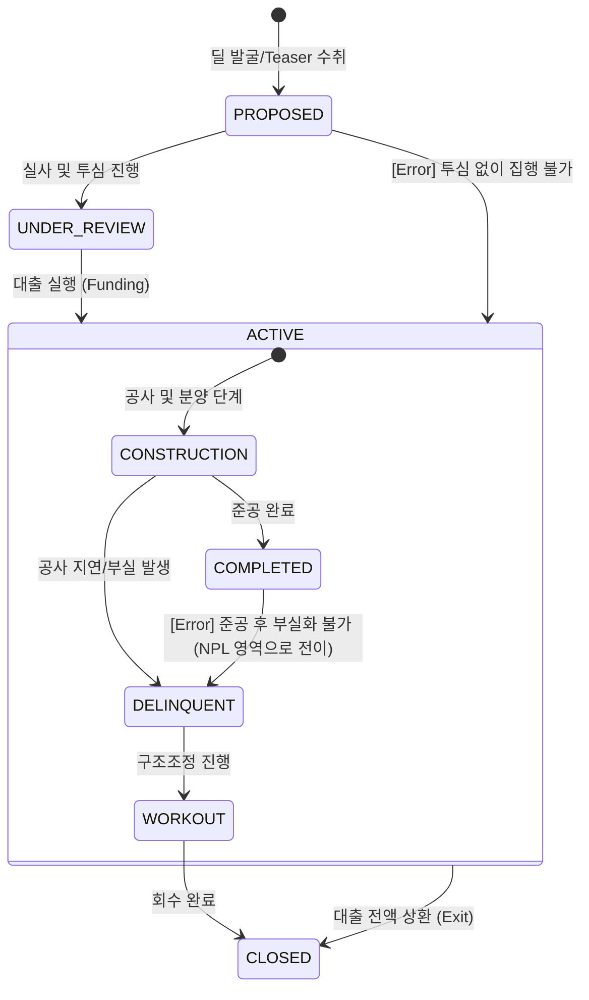

# PF 라이프사이클 및 이벤트 모델 명세

## 1. 개요 (Overview)
본 문서는 PF(프로젝트 파이낸싱) 딜의 생애주기를 상태 전이(State Transition)와 비즈니스 이벤트(Event) 관점에서 정의합니다. 특히 **이벤트 정합성 검증(Validation Layer)**을 통해 논리적 결함이 없는 견고한 도메인 명세를 구축합니다.

---

## 2. State Machine (상태 전이 모델)

PF 딜의 상태는 인허가 및 자금 조달 단계에 따라 다음과 같이 전이됩니다.

---

## 3. Full Event Catalog & Validation Layer

모든 이벤트는 정합성 검증 규칙을 준수해야 합니다.

| Event Name | Pre-condition (필수 상태/데이터) | Trigger Condition | Post-state | Invalid Transition |
| :--- | :--- | :--- | :--- | :--- |
| **MANDATE_RECEIVED** | `PROPOSED` / `Project_ID` 존재 | 주관사 선정 업무협약 체결 | `UNDER_REVIEW` | `ACTIVE`로의 직접 전이 |
| **LOAN_APPROVED** | `UNDER_REVIEW` / `Credit_Commit_ID` | 투자심의위원회 승인 완료 | `UNDER_REVIEW` (Approved) | `PROPOSED` 상태에서 발생 |
| **FUNDING_EXECUTED** | `Approved` / `준공확약서` 수취 | 대출 계약 체결 및 인출 | `ACTIVE:CONSTRUCTION` | `PROPOSED`, `CLOSED` 상태 |
| **PRE_SALE_SHORTFALL** | `CONSTRUCTION` / `분양률` 데이터 | 목표 분양률 대비 미달 발생 | `DELINQUENT` | `PROPOSED`, `COMPLETED` 상태 |
| **COMPLETION_RISK** | `CONSTRUCTION` / `공정률` 지연 | 시공사 부실 또는 공사 중단 | `DELINQUENT` | `PROPOSED`, `CLOSED` 상태 |
| **EXIT_COMPLETED** | `COMPLETED` / `정산서` | 대출 원리금 전액 상환 | `CLOSED` | `DELINQUENT` 상태에서 직접 전이 |

---

## 4. 리스크 전이 논리 (Event Logic)

### 가. 정합성 검증 규칙 (Validation Rules)
1. **상태 배타성**: `CONSTRUCTION` 상태와 `WORKOUT` 상태는 상호 배타적이며, 동시에 존재할 수 없음.
2. **데이터 무결성**: `FUNDING_EXECUTED` 이벤트는 반드시 `Credit_Commit_ID`와 `준공확약서` 데이터가 시스템상에 존재할 때만 트리거 가능.
3. **경로 고정**: 모든 딜은 반드시 `CLOSED` 상태에 도달하기 위해 `EXIT_COMPLETED` 또는 `WORKOUT_END` 이벤트를 거쳐야 함.

---

## 🔗 연결
- [PF 도메인 기초 및 명세](./Basics.md)
- [PF 리스크 매핑 가이드](./PF_Mapping.md)

### ─────────────

*최종 업데이트: 2026-04-16 (논리적 정합성 규칙 강화)*
