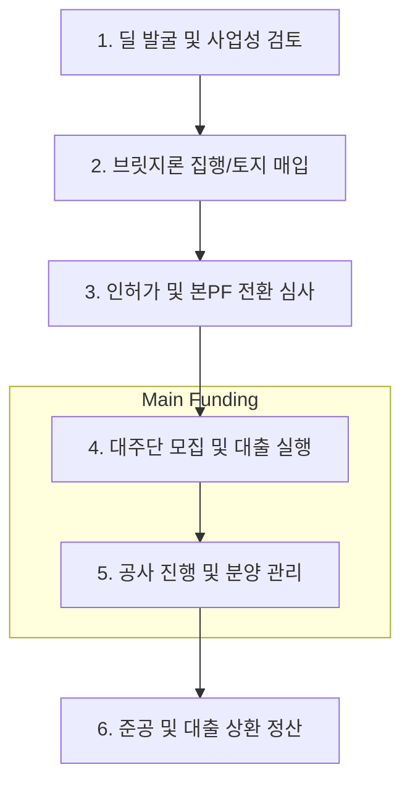

# PF 딜 라이프사이클 및 북킹 가이드 (PF Deal Lifecycle & Booking)

## 🔥 목적

부동산 및 개발 프로젝트 파이낸싱(PF)의 딜 발굴부터 심사, 대출 실행, 사후 관리 및 시스템 북킹 표준을 정의합니다. 
PF는 토지 매입부터 준공까지의 시계열적 리스크 관리가 핵심입니다.

### ─────────────

## 📌 1. 전 과정 업무 흐름도 (End-to-End Flow)

PF 사업은 브릿지론을 통한 토지 확보와 본PF를 통한 건설 자본 공급으로 이어집니다.

### 업무 프로세스 시각화

### ─────────────

## ⚙️ 2. 단계별 상세 가이드

### Phase 1. 사전 검토 (Sourcing & DD)
- **사업 지지 분석**: 위치, 공급 물량, 분양 예상가, 시공사 예정사 실사.
- **인허가 검토**: 지구단위계획, 건축 허가 가능성 등 법률적 리스크 확인.

### Phase 2. 브릿지론 (Bridge Loan)
- **토지 확보**: 본PF 전 단계의 초기 자산 확보용 단기 대출.
- **북킹**: 고금리 단기 연체 가능성 및 본PF 전환 확약 여부 등록.

### Phase 3. 본PF 전환 및 심사 (Underwriting)
- **시공사 보증**: **책임준공 확약** 및 공사비 도급 계약 확정.
- **분양 승인**: HUG 보증 또는 분양 신고 완료 여부 확인.

### Phase 4. 대출 실행 및 집행 (Funding & Drawdown)
- **자금 인출**: 공정률에 따른 기성고 대출 집행.
- **에스크로**: 모든 수입/지출을 독립된 계좌에서 통제.

### Phase 5. 사후 관리 및 종료 (Exit)
- **분양 대금 관리**: 분양 수입금으로 대출 원리금 조기 상환 처리.
- **신탁 종료**: 준공 후 보존 등기 및 대주단 수익 확정.

### ─────────────

## 📂 3. 실무 북킹 정보 표준 (Booking Information)

### 가. 프로젝트 및 발행 정보
- **기본 정보**: 프로젝트명, 담당 RM본부, 투심위 승인번호.
- **딜 유형**: 브릿지론, 본PF, 선/중/후순위 구분.
- **사업 단계**: 인허가 전/후, 착공 전/후, 분양 중 등 실시간 상태.

### 나. 대출 및 트랜치 상세 데이터
- **약정 정보**: 총 펀딩 규모, 해당 기관 인수 금액, LTV(준공 후 가치 기준).
- **금리 구조**: 기준 금리(CD 등) + 가산 금리(Spread).
- **상환 조건**: 만기일시상환, 분할상환, 조기상환 조건.

### 다. 담보 및 신용보강
- **시공사 정보**: 시공사명, 도급순위, 신용등급.
- **신용보강 형태**: **책임준공 확약**, 채무인수, 매입확약(증권사).
- **자금 관리**: 에스크로(Escrow) 계좌 정보 및 인출 우선순위(**Waterfall**).

### ─────────────

## 🔗 연결

- [프로젝트 파이낸싱 기초 (PF Basics)](Basics.md)
- [PF 리스크 매핑](./PF_Mapping.md)

### ─────────────

*최종 업데이트: 2026-04-14*
