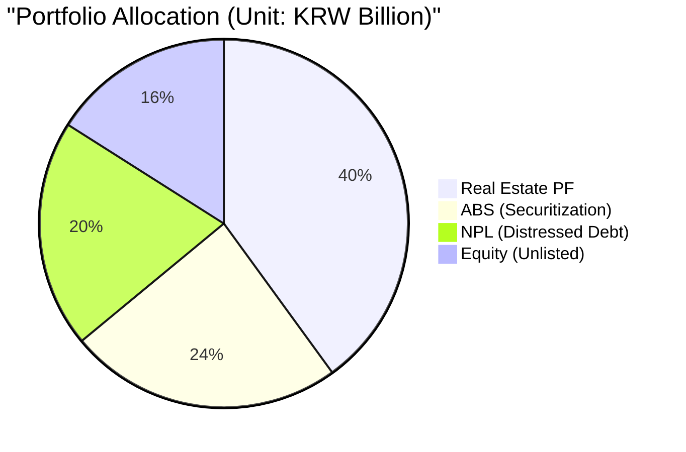
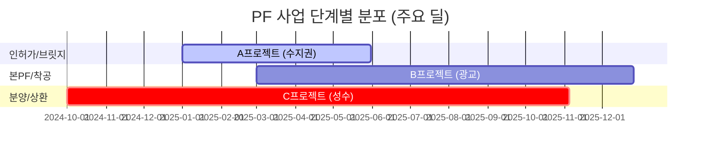
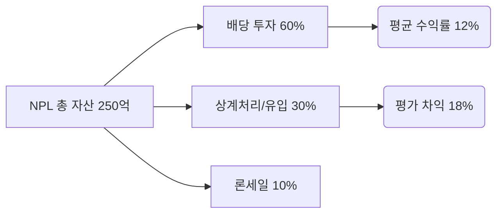
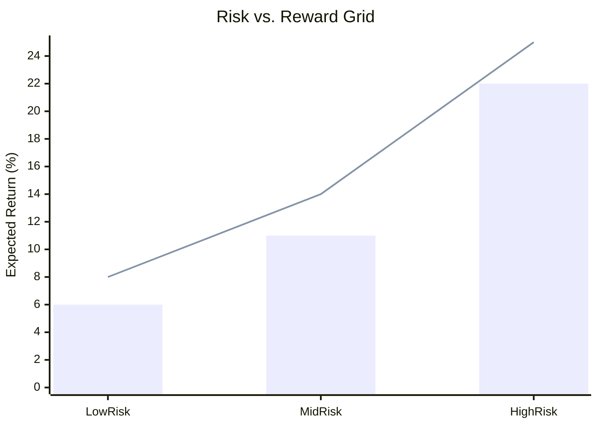

# IB 통합 리스크 & 퍼포먼스 대시보드 (IB Intelligence Dashboard)

본 대시보드는 4대 핵심 자산(ABS, NPL, PF, Equity)의 운용 현황과 리스크 지표를 실시간으로 통합 시각화합니다. 
*(데이터 기준일: 2026-04-10, 시뮬레이션 샘플 포함)*

---

## 🚩 레드 플래그 및 긴급 주의 (Red Flags)

> [!CAUTION]
> **주요 리스크 경보**
> 1. **PF 평가 등급 하락**: '부실우려' 등급 사업장 2건 발생 (총 150억 규모) -> [PF 대시보드로 이동](#부동산-pf-점검-현황)
> 2. **ABS 차환 리스크**: 단기 ABCP 매입확약 300억 만기 도래 (차환율 91%로 하락 중)
> 3. **NPL 회수 지연**: 유치권 분쟁으로 인한 경매 2회 유찰 사업장 발생

---

## 1. 포트폴리오 총괄 (Global Executive View)

| 항목 | 현재 수치 | 전분기 대비 | 상태 |
| :--- | :--- | :---: | :---: |
| **전체 AUM (운용자산)** | **1,250억 원** | +8.2% | 🟢 |
| **가중평균 리스크 점수** | **4.2 / 10** | +0.5 | 🟡 |
| **기대 손실 (Expected Loss)** | **6.5억 원** | +1.2억 | 🟠 |

### 자산군별 투자 비중 (AUM Allocation)

---

## 2. 자산별 심층 관제 (Asset Control Center)

### 부동산 PF 점검 현황
**[PF 딜 라이프사이클 참조](03_Assets_Verticals/PF/PF_Deal_Lifecycle.md)**

| 등급 | 비중 | 리스크 판정 | 상태 |
| :--- | :---: | :--- | :---: |
| **양호** | 70% | 정상 이자 수취 중 | 🟢 |
| **보통** | 20% | 분양률 60% 미만 추적 중 | 🟡 |
| **유의/부실** | 10% | **자율매각 및 공매 검토** | 🔴 |

---

### ABS 및 유동화 리스크
**[ABS 딜 라이프사이클 참조](03_Assets_Verticals/ABS/ABS_Deal_Lifecycle.md)**

- **차환 구조 건전성**: ABCP(90%) / ABL(10%) -> 단기 어음 비중이 높아 금리 인상 시 조달 비용 상승 리스크 존재.
- **신용보강 상태**: 시공사 책임준공(85%), 증권사 매입확약(15%).

---

### NPL 회수 성과 (Recovery Performance)
**[NPL 딜 라이프사이클 참조](03_Assets_Verticals/NPL/NPL_Deal_Lifecycle.md)**

---

### Equity 평가 손익 (Unlisted Assets)
**[비상장 주식 딜 라이프사이클 참조](03_Assets_Verticals/Equity/Unlisted_Deal_Lifecycle.md)**

- **취득 원가**: 180억 원
- **Fair Value (MTM)**: 215억 원 (**미실현 이익 +35억**)
- **주요 이벤트**: 포트폴리오사 A 'Pre-IPO' 단계 진입, B사 '시리즈 C' 후속 투자 유치 성공.

---

## 3. 리스크-수익 프론티어 (Risk-Reward Mapping)

*(Bar: Risk Score, Line: Target Return %)*

---
*최종 업데이트: 2026-04-11 (본 지표는 Risk Engine 기술 스펙을 기반으로 시뮬레이션 되었습니다)*
